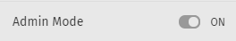
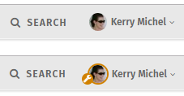
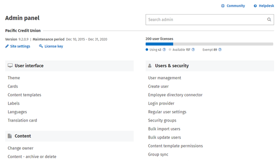
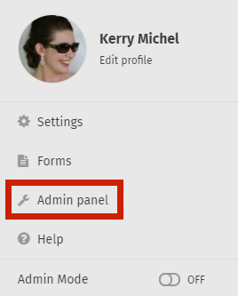
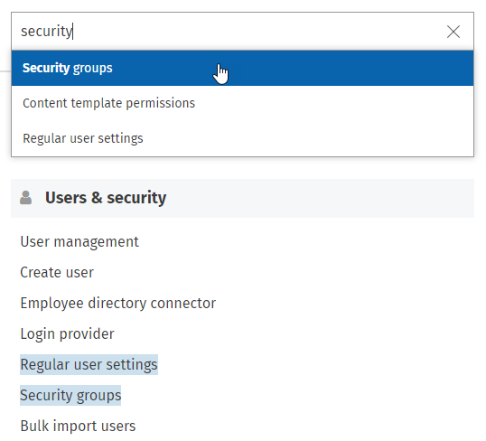

# Admin Mode and Admin panel

## Admin Mode

Admin Mode allows administrators to view the intranet without any security restrictions in place. Administrators who have Admin Mode turned on can see **everything** on the intranet, including pages that are private, posts that are set to be published in the future, and inactive user profiles.  
  
An administrator with Admin Mode turned off sees the intranet with their normal security permissions in place.

## Turn Admin Mode on or off

1. Click on your **name** or **profile photo** in the top right.
2. In the menu that opens, find **Admin Mode**. The **toggle** next to it will show whether Admin Mode is currently ON or OFF.      
3. Click the **toggle** to turn Admin Mode **ON** or **OFF**.

## Admin Mode icon

When Admin Mode is turned on, your profile photo on the right of the Application Toolbar displays with a colored border and tool icon to remind you that Admin Mode is on.  
  
**Application Toolbar with Admin Mode OFF and ON**   
 

## Admin panel

To get to the Admin panel, click on your **name** or **profile photo** on the top right of any page. In the menu that opens, click **Admin panel**. You do not need to have Admin Mode turned on to access the Admin panel.  
  
    
  
The Admin panel is your homepage for all things administrator - the place where administrators can make behind-the-scenes changes that affect the way the intranet looks and functions.  
  
The Admin panel has a fresh new look as of version 9.2. The redesign includes important site info at the top of the page, an Admin panel Search feature, and conveniently placed links to our TF Community and Helpdesk sites.

## Admin panel search

If you're looking for a particular Admin page or feature, type it into the Admin search box. The search will bring up a dropdown list of Admin pages that match your query, and it will also highlight the titles of the Admin pages that match, for easy reference.

## Learn more:

Discover our Administrator documentation with one of these topics:

* [Customize your theme](https://community.thoughtfarmer.com/content/105935/customize-your-theme)
* [Content templates](https://community.thoughtfarmer.com/content/106025/content-templates)
* [User management](https://community.thoughtfarmer.com/content/105939/user-management)

