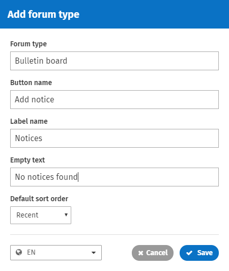

# Create a custom forum type

## Create a custom forum type

You can create custom forum types in addition to the three defaults for a customized form of discussion or information exchange.

1. Go to the **Admin panel**: **Content** section &gt; **Forum types** page.
2. Click **Add** **forum type** on the top left. The **Add forum type** window will appear.
3. In the **Forum type** field, type your custom forum type name.     
4. In the **Button name** field, type your custom "Add post" button name. This button is found above the forum posts.
5. In the **Label name** field, type the name for a forum post on your custom forum. This name shows with the number of forum posts in the forum statistics portlet on the right-hand side of the forum. \(Label names for the default forum types are: topics, ideas, and questions.\)
6. In the **Empty text** field, type the text you want to appear if there are no posts in the forum, or if no results are found in the forum search. \(eg. No topics found.\)
7. Choose a **Default sort order** from the dropdown. \(See below for more information on sort order.\)
8. If multiple languages are enabled, click the language icon at the bottom to open a dropdown menu. Select another enabled language, and fill in the fields described above for the other languages.
9. Click **Save**.

To edit a default or custom forum type, go to the **Admin panel**: **Content** section &gt; **Forum types** page, hover over the forum type you wish to edit, and click the edit icon on the right.  

