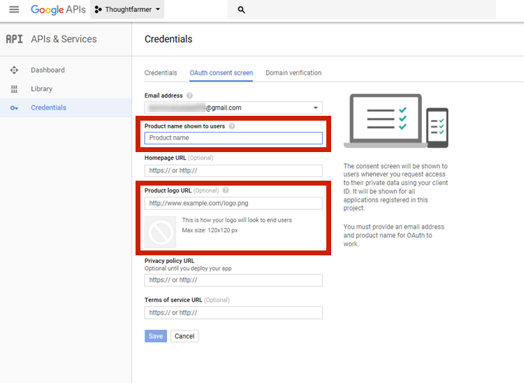
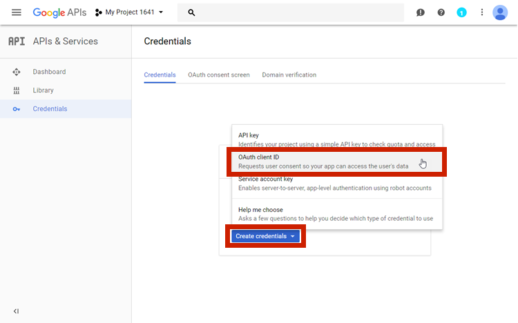
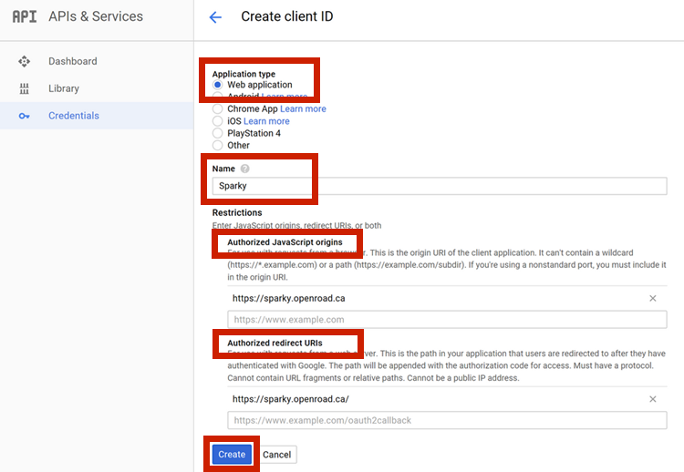
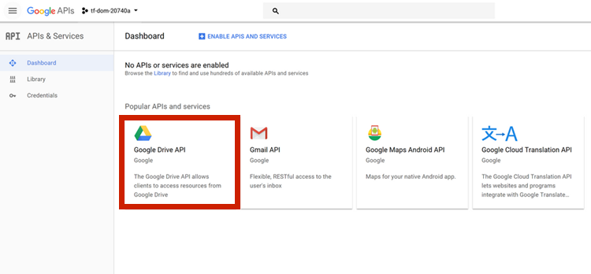
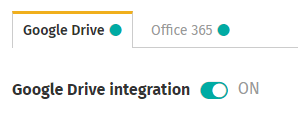

# Google Drive integration

Google Drive files and folders can be linked and embedded in intranet pages, and searched from the intranet using ThoughtFarmer's Cloud drive integration features. To use the Google Drive Card or other Google Drive integration features such as linking and search, Google Drive integration must first be set up. Follow the instructions below to set up Google Drive integration.  
  
For user instructions on Google Drive integration features, see [Cloud drive integrations](../../using-thoughtfarmer/cloud-drive-integration/).  
For user instructions on adding the Google Drive Card to a page, see [Google Drive Card](../../using-thoughtfarmer/add-pages-and-sections/set-up-cards/google-drive-card.md).

## Configure Google Apis to allow access from ThoughtFarmer

1. Sign in to your organization's Google account.
2. Go to [Google APIs Google Developers Console](https://console.developers.google.com/apis/dashboard).
3. Create a project. Type a project name.
4. With your new project selected, navigate to the **Credentials** tab on the left. Select the **OAuth consent screen** tab at the top.
5. Type a **Product name shown to users**, for example, the name of your intranet or ThoughtFarmer site.
6. Optionally, add a **Product logo URL**.     
7. Select the **Credentials** tab at the top. Click **Create credentials** &gt; **OAuth client ID** in the pop-up window that appears.     
8. Under **Application type**, select the radio button for **Web application**.     
9. Add a **Name**.
10. Enter the ThoughtFarmer site homepage in the **Authorized JavaScript origins** and **Authorized redirect URLs** sections.
11. Click **Create**.
12. Copy the **Client ID value** in the pop-up window that appears, and click **OK**.

## Enable Google Drive API

1. Select the **Dashboard** tab on the left.
2. Search for the **Google Drive API** and enable it.     

## Enable Google Drive integration

1. On your ThoughtFarmer intranet site, go to the **Admin panel: Integrations** section &gt; **Cloud drive** page.
2. Under the **Google Drive** tab, click the toggle beside **Google Drive integration** to turn it **ON**.     
3. Click in the **Google Drive Client ID** box and paste the **Client ID Value** that you copied when configuring Google APIs in the instructions above.
4. Click **Save** beside the **Google Drive Client ID** box.
5. The **Reference Name** box will contain a default name for the Google Drive. This is the name users will see when they are accessing cloud drive integration features for Google Drive on the intranet. If you wish to change the reference name, click the **pencil icon** to edit, type a new reference name in the box and click **Save.**
6. If you want to allow users to search Google Drive from the intranet, click the **Google Drive search** toggle to turn it **ON**.   
   1. When **Google Drive search** is turned **ON**, another option appears   that controls the maximum number of Google Drive search results that will appear in the Find-as-you-type search results. To edit the number of results, click the **pencil icon**, enter the new number and click **Save**. \(To learn more about cloud drive search, see [Search cloud drives](../../using-thoughtfarmer/cloud-drive-integration/search-cloud-drives.md).\)
7. Google Drive integration is now enabled.

### Items to note

* Google may take some time to update their servers, so the Google Drive integration may not work immediately.
* When logging in, users will see the security warning, pictured below. To log in, users need to click **Advanced &gt; Go to \[Google App name\] \(unsafe\)**. Google has [instructions for removing this warning](https://support.google.com/cloud/answer/7454865?authuser=1).

