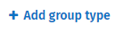
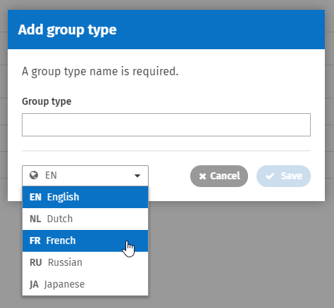

# Group types

## Configure group types

Group Types are a configurable set of classifications that can be assigned to any group. This allows for further refinement of searches on the Group Directory. Any time a group is created or edited it can be classified as a certain type. By default ThoughtFarmer comes with the following group types available:

* Group
* Location
* Department
* Team
* Project
* Business Unit

Profile pages show a list of groups that a user belongs to.

## Add a group type

1. Go to the **Admin Panel**: **Content** section &gt; **Group types** page.
2. Click **Add group type** on the left.   
3. Enter the group type name in the site language in the **Group type** field.      
4. If you have multiple languages enabled on your intranet, click on the **language icon** at the bottom of the **Add group type** window to open the dropdown, and click to select a language. Enter the **Group type** name for other enabled languages.
5. Click **Save**.
6. To change the order of the group types for display in menus and search, hover over the list icon on the left and drag and drop the group types.

## Edit a group type

You can change the name of existing group types. All groups already associated with that group type will use the new value. Click the number in the Usage column beside a group type to see which pages are using the group type and who owns those group pages.

1. Go to the **Admin Panel**: **Content** section &gt; **Group types** page.
2. Hover over the **group type** you wish to change, and click the **Edit icon** that appears on the right. The Edit group type window will appear.
3. Enter the new group type value for the site language in the **Group type** field.
4. If you have multiple languages enabled, click on the **language icon** at the bottom of the **Add group type** window to open the dropdown, and click to select a language. Enter the **Group type** name for other enabled languages.
5. Click **Save**.

## Delete a group type

You can delete a group type if it does not have any pages associated with it. The number of pages using the group type is listed in the Usage column beside the group type. Click on the number to view the pages using that group type. Groups using a group type must be switched to a different group type before the group type can be deleted.

1. Go to the **Admin Panel**: **Content** section &gt; **Group types** page.
2. Hover over the name of the group type you wish to delete.
3. Click on the trashcan icon that appears on the right of the group type. \(If any pages are using the group type, the trashcan icon will not appear.\)
4. Click **Delete** in the **Delete group type** window that appears to confirm the deletion.

