# Office365/SharePoint Online integration

Office 365/SharePoint Online files and folders can be linked and embedded in intranet pages, and searched from the intranet using ThoughtFarmer's cloud drive integration features. To use cloud integration features such as linking and search, Office 365/SharePoint Online integration must be enabled. Follow the instructions below to first configure and register an app with Azure AD, and then set up the integration with your ThoughtFarmer intranet.  
  
For user instructions on Office 365/SharePoint Online integration features, see [Cloud drive integrations](../../using-thoughtfarmer/cloud-drive-integration/).  
  
Microsoft Graph is a developer platform that allows ThoughtFarmer to integrate with Azure Active Directory and Office 365. Configuring ThoughtFarmer with Azure Active Directory requires granting some permissions to Microsoft Graph.

## Configure/Register App with Azure AD

Note that the integration with Office 365 requires that the ThoughtFarmer site is running using HTTPS. Also, one of the steps in this process requires the user accessing the Azure portal to be an Admin.

1. Go to the Azure portal home page.     
2. Click **Azure Active Directory** on the left.
3. Click **App registrations** in the new left hand menu that appears.     
4. Click **New application registration**.     
5. Enter the following in the corresponding boxes:
   1. **Name**: Enter a name for the app registration \(eg. ThoughtFarmer\).
   2. **Application type**: This should be set to Web app / API
   3. **Sign-on URL**: Enter the URL for the ThoughtFarmer site \(eg. [https://intranet.pacificcreditunion.com/\)](https://intranet.pacificcreditunion.com/%29)   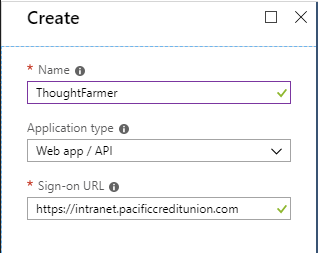  
6. Click the **Create** button. Once the registration is complete you will see the details of the registered app.   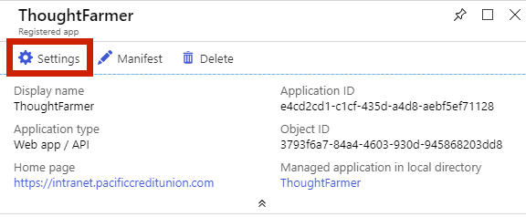  
7. Click **Settings** to continue the configuration.
8. Click **Properties** to confirm the current values.   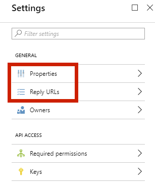  
9. Click **Reply URLs** to set the reply URL for our application.
   1. The Reply URL is where the browser is sent once the negotiation is complete. Enter your site URL/office365 eg. [https://intranet.pacificcreditunion.com/office365](https://intranet.pacificcreditunion.com/office365)    
   2. Click **Save** at the top.
10. Click **Required permissions** to set the permissions for the APIs we wish to use.   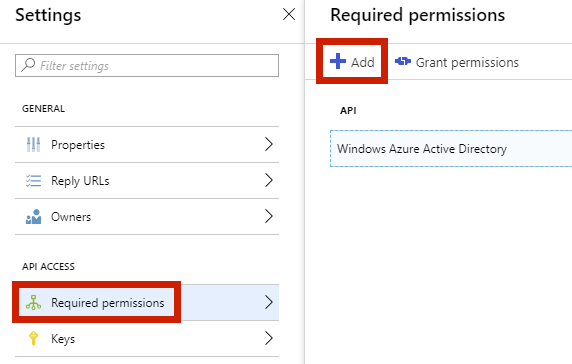  
11. Add Microsoft Graph:
    1. Click **Add**, then click **Select an API**.   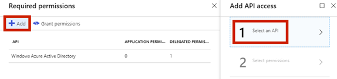  
    2. Select **Microsoft Graph**.   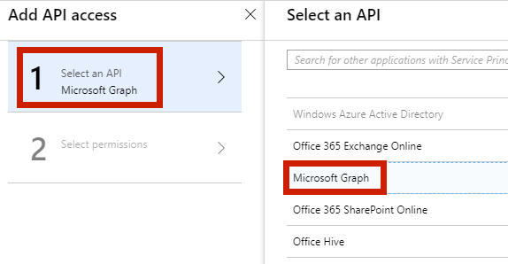  
    3. Click **Select permissions**.   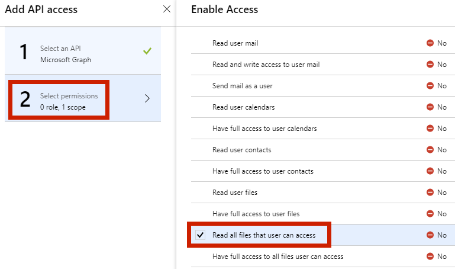  
    4. Under **Delegated permissions**, select **Read all files that user can access**.
    5. Click **Select** at the bottom to continue, then click **Done**.
    6. Select **Microsoft Graph** to highlight it, then click **Grant permissions**. When the permissions apply correctly you will see a success message.   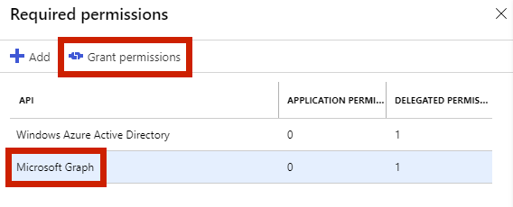    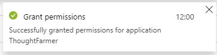 
12. \(Optional: If your organization uses OneDrive but not SharePoint Online, this step is not required.\) Add Office 365 SharePoint Online:
    1. Click **Add**, then click **Select an API**.
    2. Select **Office 365 SharePoint Online**.
    3. Click **Select permissions**.
    4. Under **Delegated permissions**, select **Run search queries as a user**.
    5. Click **Select** to continue, then click **Done**.
    6. Select **Office 365 SharePoint Online** to highlight it, then click **Grant permissions**. \(The user accessing the Azure Portal must be an Admin to be able to Grant these permissions for Office 365 SharePoint Online. If the user does not have the correct permissions then an error will occur when granting permission.\) When the permissions apply correctly you will see a success message.
13. A change is required to the manifest file for the registered application. On the **Details** screen, click **Manifest**.     
    1. The Manifest is a JSON document. Find the key oauth2AllowImplicitFlow and change its **value** to **true.**  

         

    2. Click **Save**.
14. Copy the **Application ID value** from the **Details** screen for configuring the integration in ThoughtFarmer.   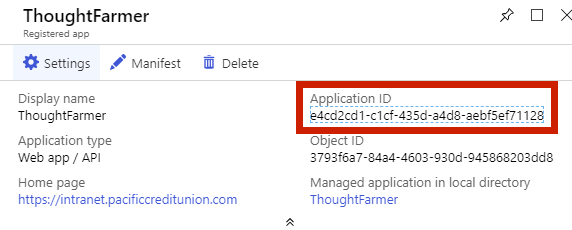 

## Enable Office 365/SharePoint Online integration

1. On your ThoughtFarmer intranet site, go to the **Admin panel: Integrations** section &gt; **Cloud drives** page.
2. Under the **Office 365** tab, click the toggle beside **Office 365 integration** to turn it **ON**.   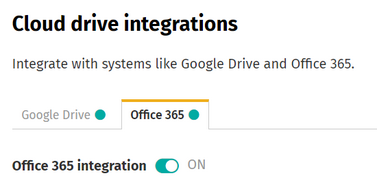  
3. In the **Office 365 tenant name** box, enter the tenant name for your portal. \(Your tenant name was given to you by Microsoft when you signed up for Office 365. It should look like yourdomain.sharepoint.com or yourdomain.onmicrosoft.com.\) Click **Save** beside the **Office 365 tenant name** box.   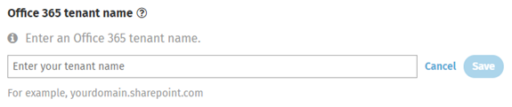  
4. Click in the **Office 365 Client Id** box and paste the **Application ID Value** that you copied when configuring the app with Azure AD in the instructions above. Click **Save** beside the **Office 365 Client Id** box.   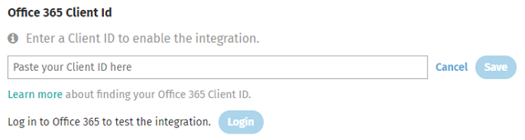  
5. In the **Sharepoint Online URL** box, enter your organization's SharePoint URL \(eg. [https://yourdomain.sharepoint.com\);Click](https://yourdomain.sharepoint.com%29%3Bclick/) **Save** beside the **Office 365 SharePoint url** box.
6. If you want to allow users to search Office 365 \(OneDrive/Sharepoint Online\) from the intranet, select either the **OneDrive** or **OneDrive and Sharepoint Online** radio buttons under **Office 365 search**, depending on what you want to be available search.   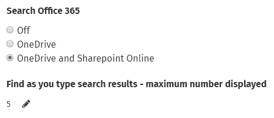   When **Search** **Office 365** is enabled, another option appears that controls the maximum number of OneDrive/SharePoint Online search results that will appear in the Find-as-you-type search results. To edit the number of results, click the **pencil icon**, enter the new number and click **Save**. \(To learn more about cloud drive search, see[ Search cloud drives](../../using-thoughtfarmer/cloud-drive-integration/search-cloud-drives.md).\)
7. Office 365 integration is now enabled.

  

  

