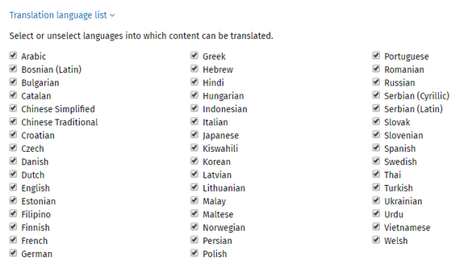

# Automatic translation

Automatic translation is available for users when viewing a page that has the Translate Card on it. With the Translate Card present on a page, users can quickly get a version of a page in any of the available languages. Due to the limitations of machine translation, users should know that while the auto-translate feature gives a sense of what the page is about, it should not be relied upon for detailed and accurate translation. ThoughtFarmer uses Microsoft Translator to provide automatic translation.  
  
Automatic translation is also available in edit mode to help create multilingual pages. \(This page explains how admins can enable automatic translation. To learn more about using it, see [Create multilingual page](../../using-thoughtfarmer/languages-and-translation/create-multilingual-page.md).\)

## Configure the Translate Card

Administrators can choose whether the Translate Card translates automatically when a user visits a page that is not in their default language, or whether users must manually request an auto-translation.

To select the type of auto-translation:

1. Go to the **Admin panel: User interface** section &gt; **Translation Card** page.
2. Select the **radio button** for the desired Translate Card behavior:
   1. **Manual**: Users must click Translate in the Translate Card to trigger auto-translation.
   2. **Automatic**: Auto-translation happens automatically when a user visits a page that has a Translate Card on it and is not in their default language.
3. Click **Save**.

## Select available translation languages

Microsoft Translator provides auto-translation into many languages. Users can choose to see auto-translations into languages other than their default language in ThoughtFarmer. \(To learn more, see the heading "Translate to a language that is not your preferred language" on [Auto-translate a page](../../using-thoughtfarmer/languages-and-translation/auto-translate-a-page.md).\)  
  
Administrators can choose which languages are available to select from for auto-translation. \(This does not apply to auto-translation in edit mode. To configure those languages, see [Configure Languages](configure-languages.md).\)  
  
To select available auto-translate languages.

1. Go to the **Admin panel**: **User interface** section &gt; **Translation card** page.
2. Click **Translation language list** to expand the language list.  

      

3. Select checkboxes for languages that you want to be available for auto-translation. Deselect checkboxes for languages that you do not want to be available.
4. Click **Save**.

## Enable automatic translation in edit mode

This configuration setting controls the automatic translation capability found in edit mode. Auto-translation in edit mode allows users to create multilingual pages using automated translation.

1. Go to the **Admin panel**: **Advanced** section &gt; **Configuration settings** page.
2. Type "translation" in the **Search config settings** box to refine the results, and then find the config setting automatic.translation.enabled.
3. Click on the **Value** column beside the config setting, select the **true** button, and click **Save**.

Once enabled, pages in edit mode will have a globe icon beside the word **Translate** in the top right. When you click on **Translate** a menu pops up with options to auto-translate to only the _enabled_ languages. See [Configure languages](configure-languages.md) to learn how to enable languages.

