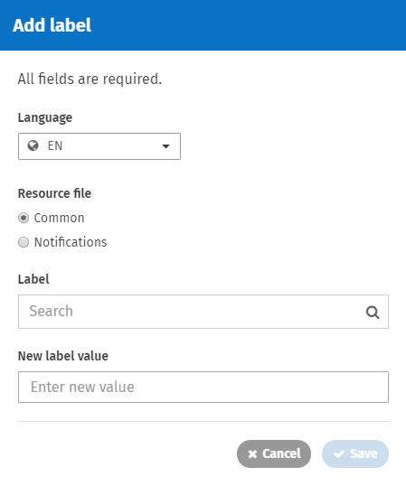

# Labels

## Labels and values

A label is a named placeholder for text that appears within the user interface of the site. These labels identify what text appears in buttons, fields, links, titles, etc. The following screenshot shows some of the labels and their values when editing a user profile. Every static bit of text throughout the user interface has a corresponding label and is able to be modified.

Every label has a corresponding value for each of the available languages. In the screenshot above the label called EditPlaceFirstName has the value "First name" when presented in English.  
 

## Override a Label

1. Get the label name\(s\) you wish to override in the Common labels list on the Community site.
2. Go to the **Admin Panel: User Interface** section &gt; **Labels** page.
3. To make a new label override, click **Add label**. The Add label window will appear.
4. Select the language of the override from the dropdown \(only enabled languages will show here\).     
5. Under **Resource file**, select the Common radio button.
6. Click in the **Label** search box and start typing the name of the current label. Select the label name from the dropdown menu that appears.
7. Click in the **New label value** box and enter the new value to appear in place of the current label's value.
8. Click **Save**.

To edit a label that has already been changed, hover over the existing entry and click the **pencil icon** beside the **New label value**. After editing the new label value, click the **checkmark** to save.  
  
For changes to Notification messages please create a ticket on the [ThoughtFarmer Helpdesk](http://helpdesk.thoughtfarmer.com/home).  
  
**Note:** Be careful when modifying labels that contain tokens. For example, the label EditPageCurrentEdit is "Please contact {0} or try again in {1} minutes". Which will fill in the {0} and {1} with proper values when the page is loaded. Be sure to include any tokens in the override or they will not function properly.

