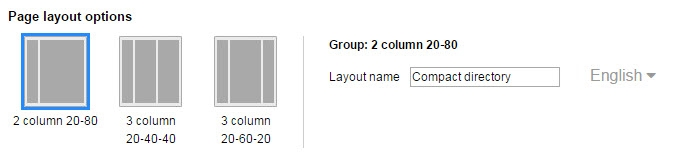
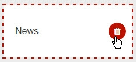
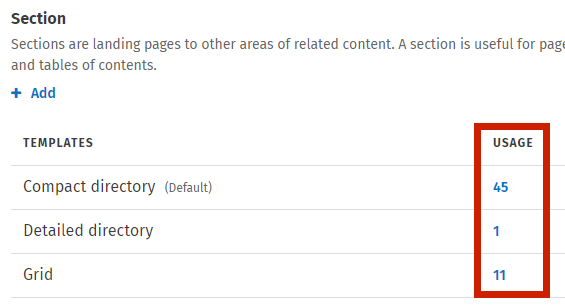
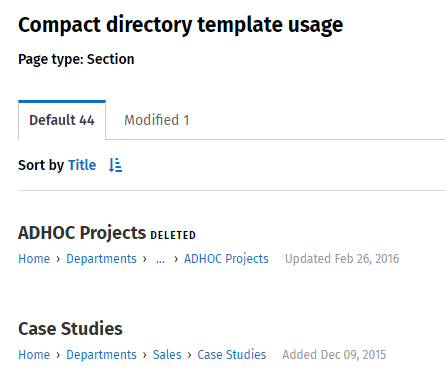
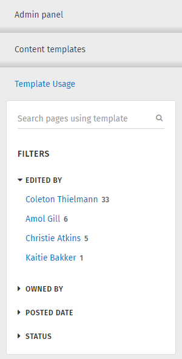

# Create and modify template

#### On this page:

* [Modify a template](../../../../using-thoughtfarmer/add-pages-and-sections/modify-templates.md)
* [Edit a template in use](./)
* [Create a new template](./)
* [Pages using specific templates](./)
* [Select default template for content type](./)
* [Delete a content template](./)

Administrators can make changes to the default templates that come with ThoughtFarmer, or create new templates for use on the intranet. To read descriptions of the different content types you can make manage templates for, click the info icon beside the Manage content templates heading on the Content templates admin page.

## Modify a template

These instructions explain how an administrator can modify a template for use on any page of the intranet.  
  
Templates can also be modified on individual pages by users that have permission to do so. Which users have permission to modify templates on individual pages is selected at the top of the **Admin panel**: **User interface** section &gt; **Content templates** page. \(**Version 9.2**: **Admin panel: Users & security** section &gt; **Content template permissions** page.\) For more information on individual users modifying templates, see [How to modify templates](../../../../using-thoughtfarmer/add-pages-and-sections/modify-templates.md).

 Go to the **Admin panel**: **User interface** section &gt; **Content templates** page.

* Find the template that you want to modify, and click on the **template icon** to open the template editor page.
* Changes you can make:
  1. **Change the page layout**: Under Page layout options, click the **template icon**. \(For more information, see [Page layout options](page-layout-option.md).\)     
  2. **Change the template name**: Click in the **Layout name** field, and enter a new template name. If you have multiple languages on your intranet, click on the **current language** to open the language menu, select another language, and enter a template name for the other languages.
  3. **Add a Card**: In the template diagram, click on the **plus sign** to add a Card in that column. Click on a Card in the menu that opens on the right to add it to the template.
  4. **Remove a Card**: Click on the **garbage can icon** on the right of a Card to remove it. \(Not all Cards can be removed.\)     
  5. **Change the order or column placement of Cards**: Click and hold on a Card and drag it up and down to reorder the Cards in that column, or drag it and drop it in another column.
* Click **Save**.

## Edit a template in use

When you change an existing template you will see a message at the top of the template editor page: "**Warning!** Any changes made will affect all pages using this template on the Intranet." This means that if you delete a Card from the template, that Card will no longer appear on pages that are using that template. If you move a Card to a different column in a template, that Card will switch columns on all pages using that template. \(Making these changes will not affect templates that have been modified by users on an individual page. For more information, see [Content template permissions](../content-type-template-permissions.md) and [How to modify templates](../../../../using-thoughtfarmer/add-pages-and-sections/modify-templates.md).\)

## Create a new template

You can create new templates for the following content types:

* Page
* Section
* Group
* Calendar
* Event
* Forum
* News/Blog
* Post
* Photo gallery
* Section
* Form

1. Go to the **Admin panel**: **User interface** section &gt; **Content templates** page.
2. Find the content type that you want to create a new template for, and click **Add**.

Refer to the **Modify a template** instructions above for the changes to make when creating a new template. Make sure to click **Save** at the bottom when you are done.

## Pages using specific templates

On the **Content templates** admin page, you can view which pages are using any given template, and which of those pages has a template that has been modified on the individual page.  
  
On the **Content templates** page, ****click on **In use** below a template **see a list of pages that use that template**. A search results type page will appear displaying all the titles of the pages using that template.

Tabs at the top split the list into pages that are using the Default template and pages that have Modified that template. Click on the tabs to view the corresponding list.

You can use the search box or filters on the left to narrow down the results by search term, page editor, page owner, posted date, tag or page status. You can also sort the list of pages by Title or Date. Click on a page title to view that page.

## Select default template for content type

For content types with more than one template, you can select the default template that will be used when a user creates that type of page.

1. Go to the **Admin Panel**: **User interface** section &gt; **Content templates** page.
2. Find the template you want to set as the default for that content type. Hover over the template and click the checkmark that appears on the right.
3. The template you have chosen as the default will show at the front of the list of templates, and will indicate that it is the default.

## Delete a content template

You can delete content templates that are not in use. If a content template is being used, the garbage can icon will not appear when you hover over the template. Before you can delete a content template, any pages using those templates will have to be switched to other templates.

1. Go to the **Admin Panel**: **User interface** section &gt; **Content templates** page.
2. Find the template you want to delete. Hover over the template and click the **garbage can** that appears on the right.
3. Click **Delete** in the pop-up window that appears to confirm the deletion.

