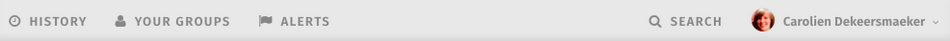
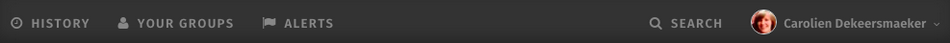

# Customize the Application Toolbar

### Customize the Application Toolbar using the Theme page

You can choose a light theme or dark theme for the Application Toolbar that shows at the top of every page.  

You can customize the appearance of the Toolbar further using Custom CSS under the CSS & Javascript tab on the Theme page. See [Use extended options for customizing ThoughtFarmer](../use-extended-options-for-customizing-thoughtfarmer/) for more information.

