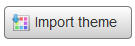

# Import or export themes

### Save and re-use themes with Import and Export theme

The **Import theme** and **Export theme** actions allow you to capture all of the settings you have chosen for your intranet's theme, and easily save them for later use, or import them all at once on to your intranet.  
  
This is useful for moving your theme from your staging to your production instance of ThoughtFarmer. You may want to test and tweak an updated or seasonal theme on your staging instance, and then transfer it to your production instance when you are happy with it.

### Export a theme

1. Go to the **Administration panel**: **User interface** section &gt; **Theme** page.
2. If you make any changes to the **Theme** page prior to exporting, make sure to **Save** your changes.
3. Click **Export theme**, and **Save file**.

The Theme will be saved as a .theme file in your Downloads folder. The filename will include your intranet name and the date and time of the export. You may wish to rename the file and move it to another folder for easy access.

### Import a theme

Importing a theme will overwrite your current theme settings. If you want to save the current theme for later use, be sure to export it before importing a new theme.

1.Go to the **Administration panel**: **User interface** section &gt; **Theme** page.

2.Click **Import theme**.

3.Click **Browse** to find, select, and open the theme file you want to import.

4.Click **Import**.

5.The Theme page will refresh with your new theme applied.

