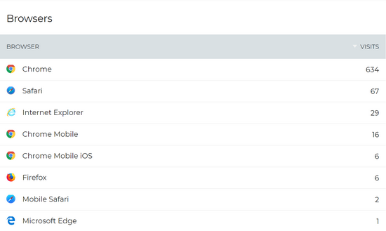
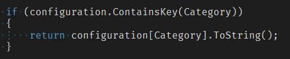

# Page header image guidlines

### Page header images

You can add visual interest and either uniqueness or continuity to pages by adding a page header image. The page header is the area below the Main Navigation Bar that contains the page title, Add, Edit and Page Sharing Buttons. If you click the down arrow on the right of the page header, it expands to reveal the Page Controls area. A unique page header image can make a page stand out from others on the intranet. The same page header applied throughout a section of the intranet can lend continuity to a department's pages, or to information all related to the same topic. Page header images can be used to good effect for different purposes.  
  
This page contains information on selecting the best page header images for your purposes. For user information about applying page headers see [Add page header images](https://community.thoughtfarmer.com/content/105841).  
  
See also [Image size guidelines](https://community.thoughtfarmer.com/content/105973) for recommended image sizes for all images used in ThoughtFarmer.

### Image guidelines for page headers

**Collapsed page header image**

Page headers display in two different states—collapsed and expanded. When you first navigate to a page, the page header is collapsed, so you see only a portion of the page header image. When you click on the down arrow on the right of the page header, the header expands to show more of the image as a background for the Page Controls and information that appear.  
  
**Expanded page header image**

The height of the expanded page header image is variable depending on the height of the content in the Page Controls.  
  
The images you upload for page headers will always fill the width of the image area. This means that small images will stretch proportionally to fit the width, and larger images will shrink proportionally to fit the width.  
  
A minimum image size of 1200 pixels in width and 700 pixels in height is recommended. Be aware that only a portion of the image will show in most instances.  
  
**Adjust the safe area to choose which part of the image will always display:**

By default, the **absolute centre** area of the image/photo will always be visible. However, you can customize what area of the photo always shows. When you add a new page header image, or edit an existing one, you will be presented with the **Page header settings pop-up window**. In this window, you can select the "safe area" of your image, or which part of the image will show even when the image is at the shortest height it can display at.

### Page or device width affects area of image shown

Depending on the width of your page, you may see more or less of your image vertically. This means that the part of the image that shows in the page header will be different on a desktop, a tablet, and a smartphone—as pictured below.  
  
The pink rectangles on the following images represent the area of the image that will show in the collapsed page header.  
  
**Desktop—full image showing area that shows in collapsed page header**

**Desktop—image as it appears in collapsed page header**

At the widest width, collapsed page header images are 1170 pixels in width by approximately 200 pixels in height.  
The height of the page header image area stays the same the narrower your page gets. This means you see more of your images vertically as the page width decreases.  
  
**Tablet—full image showing area that shows in collapsed page header**

**Tablet—image as it appears in collapsed page header**

**Mobile—full image showing area that shows in collapsed page header**

On mobile you can see nearly the entire image \(if it is a landscape oriented photo\).  
  
**Mobile—image as it appears in collapsed page header**

### Portrait versus Landscape

No matter what the orientation of your page header image, the area of the image that shows in the page header by default is still the absolute center of the image.  
  
**Desktop—full image showing area that shows in collapsed page header**

**Desktop—image as it appears in collapsed page header**

**Tablet—full image showing area that shows in collapsed page header**

**Tablet—image as it appears in collapsed page header**

**Mobile—full image showing area that shows in collapsed page header**

**Mobile—image as it appears in collapsed page header**

### Recommended dimensions

The recommended minimum image size for page header images is 1200 pixels in width by 700 pixels in height.  
  
Due to the responsive nature of ThoughtFarmer 8, we don't recommend choosing page header images based only on the collapsed page header image size. As seen above, more of the image displays when viewed on a smaller screen, such as a tablet or mobile phone. Also, when the page header is expanded to show the Page Controls, more of the image displays. If the uploaded page header image is too short, it will stretch the image to fill the full background area of the Page Controls panel.  
  
**Expanded page header—image created using recommended dimensions  ✔**

**Expanded page header—image created based on collapsed page header size only = stretched and blurry  ✘**

