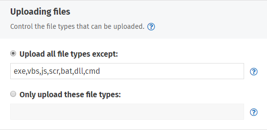
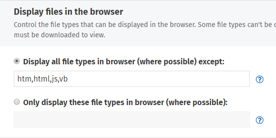

# Attachment settings

## Attachment settings

Upload and download restrictions for attachments can be set based on file type. Using this feature can restrict potentially malicious or unwanted file types from being uploaded. You can also restrict certain file types from being displayed in the browser on download. The attachment settings for both uploads and downloads can be found on the **Admin panel**: **Content** section &gt; **Files and images** page.

## Upload options

The **Uploading** **files** section on the **Files and images** page has two fields available for entry. The **Upload all file types except** list is a blacklist that will restrict _only_ those file types that are specified. The **Only upload these file types** list is a whitelist that will restrict all attachments from being uploaded _except_ those specified. 

Choose the list type that is most appropriate for your restriction scheme by selecting the radio button beside it. Then enter the list of file extensions in a comma-separated list. Click **Save** when you are done.  
  
The following shows the ThoughtFarmer default values for the upload attachment settings:

Note: If you change the list to exclude files that have previously been uploaded, they will no longer display. For images uploaded through the Rich Text Editor, only new image uploads will be affected. Previously uploaded images will continue to display.

## Display files in-browser

The display files in the browser settings will dictate which file types can be automatically displayed in the browser \(where possible\). By restricting a file type from being displayed you can force the download action to prompt the user to choose a program to open the file, or save the file to disk.

The two fields here work the same way they do in the upload settings \(above\). The **Display all file types in browser \(where possible\) except** is a blacklist, and the **Only display these file types in browser \(where possible\)** is a whitelist. Choose whichever is appropriate and enter a comma-separated list of file type extensions. Click **Save** when you are done.

The ThoughtFarmer default settings \(shown below\) restrict the most common file types that are associated with [Cross Site Scripting \(XSS\)](http://en.wikipedia.org/wiki/Cross-site_scripting) attacks.

Note: Some file types must be downloaded and saved locally before viewing regardless of the download settings in ThoughtFarmer.

