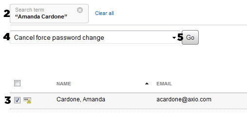

# Cancel force password change

### How to cancel force password change on next login

This action only applies to **Regular users**. When users are created with a temporary password they are forced to change this password on first login. An administrator can also flag the account to change the password through the [User Management](./) page. Any user that is required to do this will have the  icon beside their name.

### Cancel force password change

1.Go to the ThoughtFarmer **Administration Panel**: **Users & security** section &gt; **User management** page.

2.Use the filter, sort, and query tools to find the desired user or set of users \(see [Find users](find-users.md) for more info\).

3.Select the checkbox beside the desired user\(s\) with the  icon beside their name.

4.In the "Choose an action..." dropdown select **Cancel force password change**.

5.Click **Go**.

