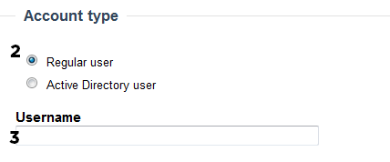

# Create Regular users

### Create Regular users

#### Before you begin

Ensure that there is an accessible Forms Authentication route configured for your ThoughtFarmer intranet. Regular users can only use Forms Authentication.  
  
You must also ensure that Regular user creation has been enabled.  
  
**Enable Regular user creation**

1. Go to the **Administration Panel**: **Authentication** section &gt; **Regular user settings** page.
2. Under **Enable regular users**, select the checkbox "Enable regular user creation".
3. Click **Save changes** at the bottom of the page.

**Go to**:

* [Create Regular users with a temporary password](create-regular-users.md)
* [Create Regular users and invite them via email](create-regular-users.md)
* [Create Profile Only users](create-regular-users.md)
* [Bulk create Regular users](create-regular-users.md)

**Note**: All passwords for Regular Users are required to be strong by default. To disable the strong password policy please see [User password management](../user-password-management/).

### Create Regular users with a temporary password

1.Go to the ThoughtFarmer **Administration Panel**: **Users & Security** section &gt; **Create user** page.

2.In the **Account Type** section ensure that "Regular user" is selected.

3.Enter the desired **username** in the provided text field.

4.Enter the user's account information in the provided text fields \(First and last name are required at a minimum\).

5.In the **Password** section select "Temporary Password".  
 

1. Fill in a password for the user.
2. Click **Create user** at the bottom of the page.

You can now send the user their login username and password manually. They will be required to change this temporary password the next time they log in. If you do not want the user to have to change their password on next login you can [cancel this](https://community.thoughtfarmer.com/content/105892).  
 

### Create Regular users and invite them via email 

This option sends an invitation with a link allowing the user to login and set their own password. Before you can invite users you must make sure that [Outgoing email](../../notifications-and-email/outgoing-email.md) has been configured.

1.Go to the ThoughtFarmer **Administration Panel**: **Users & Security** section &gt; **Create user** page.

2.In the **Account Type** section ensure that "Regular user" is selected.

3.Enter the desired **username** in the provided text field.

4.Enter the user's account information in the provided text fields \(First name, last name and email address are required\).  
 

5.In the **Password** section select "Invite user".

1. 2. \(Optional\) Modify the invite user template email if you wish to personalize it further.
3. Click **Create user**.

The user will receive an email with an invitation link in it. The link takes them to the invitation page with their username and allows them to set up their own password.  
  
Once the invitation email is sent, users appear with status "Invited" on the [User Management](../) administration page. Once they have set their password and logged in they will appear as "Active". If a user does not access the invitation link within the invitation expiry time set on the **Authentication** section: **Regular user settings**administration page then they will show as "Expired". They will need to have their original invitation cancelled and be sent a new invitation from the User Management page.  
 

### Create Profile only users 

Profile only users exist as profiles in the Employee Directory but do not have a password set and so are not able to log in. Profile only users can be used to populate your Employee Directory during a pre-rollout phase. When you are ready to roll out you can use the [User Management ](../)administration page to invite or activate these users.  
  
You can also create Profile only users to make contact information available in your employee directory for people outside of your intranet community who will never log in, such as vendors. These Profile only users will not be counted in your license count.

1.Go to the ThoughtFarmer **Administration Panel**: **Users & Security** section &gt; **Create user** page.

2.In the **Account Type** section ensure that "Regular user" is selected.

3.Enter the desired **username** in the provided text field.

4.Enter the user's account information in the provided text fields \(First and last name are required at a minimum\).

5.In the **Password** section select "No Password".

1. Click **Create user**.

### Bulk create Regular users 

Each of the account creation methods above \(temporary password, invited user, profile only\) can all also be created in bulk using a template excel spreadsheet. This allows you to create many users at a time with the added benefit of populating their profiles with additional data fields. It also allows you to automatically add all these users to security profiles. The full list of available fields are:

<table>
  <thead>
    <tr>
      <th style="text-align:left">
        <ul>
          <li>Username</li>
          <li>First name</li>
          <li>Last name</li>
          <li>Email</li>
          <li>Job Title</li>
          <li>Office phone</li>
        </ul>
      </th>
      <th style="text-align:left">
        <ul>
          <li>Mobile phone</li>
          <li>Fax</li>
          <li>Address line 1</li>
          <li>Address line 2</li>
          <li>Address line 3</li>
          <li>Address line 4</li>
        </ul>
      </th>
    </tr>
  </thead>
  <tbody></tbody>
</table>#### Bulk import users

1. Go to the ThoughtFarmer **Administration Panel**: **Users & Security** section &gt; **Bulk import users** page and download the available Excel template.
2. Fill out the Excel template with the desired users and information. Not all data needs to be complete. At a minimum username, first name, and last name are required. Save the Excel template.
3. Go back to the ThoughtFarmer **Administration Panel**: **Users & Security** section &gt; **Bulk import users** page.
4. Click **Choose File** and choose the filled out Excel template file.
5. Click **Preview**.
6. Rectify any errors or required corrections that are presented to you. You will need to modify the Excel file and begin again at step 1.
7. \(Optional\) Add the users to any desired security groups by clicking **Edit security groups** in the **Security groups** section of the Preview page. All users will be added to the system security group "All registered users" automatically.
8. If you wish to send invitation emails to all users, then modify the invitation if you wish, and click **Create users.** If you do not wish to invite them at this time then ensure that you select "Don't send invitations with this batch" before clicking **Create users.**

If you did not invite the users in step 8 above then you will need to activate their account manually or invite them at a later point using the [User Management](../) administration page. Otherwise they will not be able to access ThoughtFarmer.

