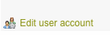

# Reset a user's password

### How to reset a user's password

Regular users can reset their own password from the login screen using the **Forgot Password** link. So resetting a user's password should only be required when this feature is not available to them.  
  
Active Directory users can change their password at any time if you have enabled "Allow password changes" in the Administration Panel. Please see [password management for AD users](user-password-management/password-management-for-active-directory-users.md) for more information. However, if an AD user has forgotten the password then the only way to reset it is via a Domain administrator on your network.  
  
External users' login credentials are determined by a third-party application, not ThoughtFarmer. External users' passwords must be changed via the third party application.

### Reset a Regular user's password

1.Go to the ThoughtFarmer **Administration Panel**: **Users & security** section &gt; **User management** page.

2.Use the filter, sort, and query tools to find the desired user \(see [Find users](find-users.md) for more info\).

3.Click the **gear icon** in the **Action** column to the right of the user, and click **Edit account** in the menu that opens.

4.Enter a new password in the **Reset Password** text field.

5.Click **Save.**

The **Edit user account** link is also available to administrators at the bottom left when editing a user's profile.

  
 

