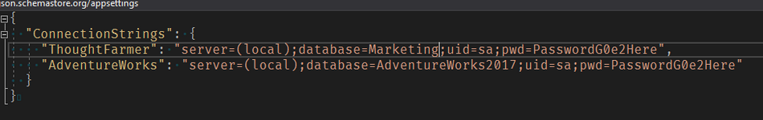

# Developer notes

These notes highlight the specific key points in the AdventureWorks sub-application example code for developers to be aware of. 

* [Startup.cs](https://community.thoughtfarmer.com/content/111837/developer-notes#startup)
* [Program.cs](https://community.thoughtfarmer.com/content/111837/developer-notes#program)
* [appSettings.json](https://community.thoughtfarmer.com/content/111837/developer-notes#appsettings)
* [EmployeeController.cs](https://community.thoughtfarmer.com/content/111837/developer-notes#employee)
* [ProductsController.cs](https://community.thoughtfarmer.com/content/111837/developer-notes#products)
* [/js/employee.jsx](https://community.thoughtfarmer.com/content/111837/developer-notes#jsemployee)
* [/css/products.css](https://community.thoughtfarmer.com/content/111837/developer-notes#cssproduct)

### Startup.cs 

This is a custom / extended version of this file that will add some ThoughtFarmer specific settings to the app on Startup. Any sub application that wants to use the ThoughtFarmer template should be setup like this.

### Program.cs 

This file has some basic settings to get you started. You may not need all components. Anything not available will be ignored.

### appSettings.json 

This is where configuration can be added that is used by the application. Under **ConnectionStrings** add the _**ThoughtFarmer**_ connection string info. This will allow the application to connect to the ThoughtFarmer database. Also in this sample there is configuration for connecting to the _**AdventureWorks**_ database. Update this configuration so that it matches your environment.

### EmployeeController.cs 

This controller inherits from CustomCardApiBaseController. It contains the sample actions used to read and write some employee data in the _**AdventureWorks**_ database. This also contains an example on how to retrieve the details of the user logged into ThoughtFarmer.

The user will be in the _**CurrentUser**_:

### ProductsController.cs 

This controller inherits from CustomCardApiBaseController. It contains the sample actions used to report data for products from the _**AdventureWorks**_ database. As well as showing how to retrieve the current user, this controller also includes an example on how to read custom card configuration.  

### js/employee.jsx

This is a react file. [https://reactjs.org/](https://reactjs.org/). The sub-application template includes a library that will transpile and serve JSX files as plain JS.  
  
This file will load the employee information from the server and display it as a tab on the user's profile.  
  
The results will display if the current page is a profile page and the _**contentId**_ for the profile page matches the _**contentId**_ for the current user.

### css/products.css 

This is a plain CSS file for the products.css. This will have all the styles that are going to be used in the AdventureWorks Category card. The value _**/ccadventureworks/css/products.css**_ is used to populate the **CSS Url** for the page template application.   

