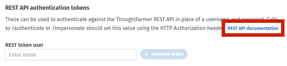

# ThoughtFarmer REST API

## ThoughtFarmer REST API

The ThoughtFarmer API is RESTful, so that the API is entirely HTTP-based. This means that methods that retrieve data from the ThoughtFarmer API require a GET request. Methods that submit, change, or destroy data require a POST, PATCH, PUT or DELETE.  
  
API Methods that require a particular HTTP method will return an error if you do not make your request with the correct method. HTTP Response Codes are meaningful. Each API method lists the HTTP Response codes that indicate an error. A response code of 200 \(OK\) means success.

## Making API calls

### Authentication

Any request to the API requires an authentication token to be passed along with it. To retrieve your API token go to the **Admin panel** &gt; **Integrations** section &gt; **API Tokens** page. Each user should be using their own token for access under the **REST API Authentication Tokens** section.  
  
Any call to the REST API must have one of the following:

### **Query string**

The token query string parameter with the API token value must be present. For example,

```text
$R = Invoke-WebRequest -Uri  https://community.thoughtfarmer.com/api/users/current?token={APIToken} -Method GET  
$R.Content
Clear-Variable R
```

### **Authorization header**

The token must be present in the header using the key "Authorization". For example,

```text
$R = Invoke-WebRequest -Uri  https://community.thoughtfarmer.com/api/users/current -Method GET -Headers @{"Authorization"="{APIToken}" }
$R.Content
Clear-Variable R
```

### **Authenticated cookie**

Any logged in user will be able to access the API directly in their browser. Try [https://community.thoughtfarmer.com/api/users/current](https://community.thoughtfarmer.com/api/users/current). This will only work for GET requests, unless you use a browser extension to generate other methods.

### Secure Requests

By default, ThoughtFarmer expects calls to its API to be made via https. If a call is not made over https then it will fail with a _**505 - HttpVersionNotSupported**_ error.  
  
This can be configured by going to the **Administration panel** &gt; **Advanced options** section &gt; **Configuration settings** page under api.mustUseHttps and setting this value to false.  
  
**NOTE:** It is only recommended to disable this setting for on-premise installations only available on your internal network. Making calls over non-ssl represents a security risk for publicly accessible ThoughtFarmer installations.

### Responses JSON

XML is no longer supported as a response type by the API for any ThoughtFarmer 9+ instance. All responses regardless of content-type header will be returned as JSON.

## Documentation

We have recently switched to using [Swagger](https://swagger.io/) tools to help us auto-generate our API documentation. These generated documents are available on any ThoughtFarmer 9+ installation. Just go to the **Admin panel** &gt; **Integrations** section &gt; **API Tokens** page. The link can be found as shown below:  
  
    
  
If you do not currently have a ThoughtFarmer 9+ installation to view this documentation you may visit [https://apidocs.thoughtfarmer.com/](https://apidocs.thoughtfarmer.com/). This is a static version of the API documentation. This site is currently only Beta, so please provide feedback and report any issues and discrepancies to [helpdesk@thoughtfarmer.com](mailto:helpdesk@thoughtfarmer.com).

