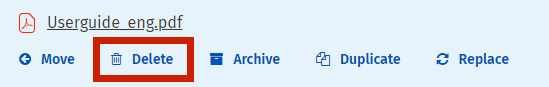
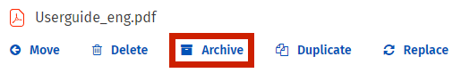

# Archive or delete files

## How to delete a file from a page

1. Click the **down arrow** on the far right of the file name to open the **File Controls**.     
2. Click **Delete**. The **Delete** pop-up window will appear.
3. Click **Delete** to confirm the deletion. The file will disappear from the page, and all comments and links to the file will be deleted.

## How to archive or restore a file

Use these instructions to archive or restore a single file. When a page is archived, the available action item will change from **Archive** to **Restore**. Archived content is hidden by default, but users can choose whether to show or hide archived content from their view on the intranet. In order to restore an archived file, you will need to show archived content so you can see the file. To learn more, see [how to archive and delete a page](https://community.thoughtfarmer.com/content/105735).

1. Click the **down arrow** on the far right of the file name to open the **File Controls**.     
2. Click **Archive** or **Restore**. The action will be applied.

## Delete, archive, or restore multiple files at once

When more than one file or folder is selected at once, you can move, delete, archive, restore, download or tag multiple files at once. You must have edit permission for a file to be able to apply these actions to it. If you have selected a file that you do not have edit permission on, these actions will not be available to you. In order to restore archived files, you must have the option "Show archived content" selected in your settings.

1. Select the **checkboxes** on the left of the files you want to change.
2. When you select a file or folder, an **Actions** menu becomes available at the top of the document library.
3. Click on **Actions**, and select the action that you want to apply to the selected files/folders. Follow the prompts to complete the desired action.    

## Hot intranet tip!

### **How to save an accidentally deleted page or file**

Accidentally deleted a file and now you want it back? Fear not. Your intranet site administrator can un-delete files and pages. Here's what you can do:

* **Contact your site administrator** immediately with the following info \(and no matter how frustrated you may feel, be super nice to your site admin!\):
  * List the name of the file, or at least the topic of the file if you don't remember the exact name
  * Note the approximate time you deleted the file
* If all goes well, your site administrator can un-delete the file.

If you find yourself asking your site admin to un-delete files and pages for you frequently, please consider getting him or her some fancy chocolates or a six pack of good beer as a thank you.

