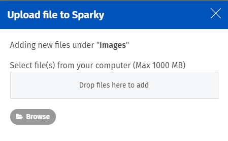
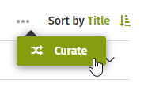
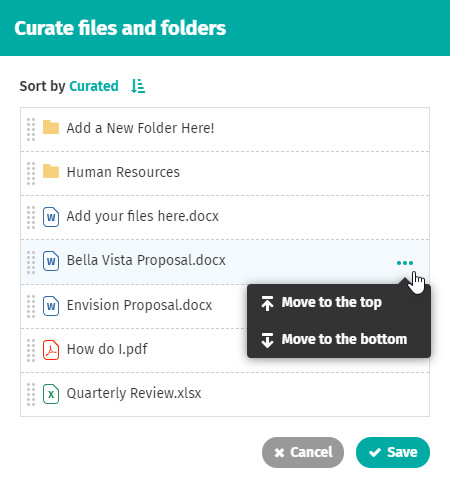
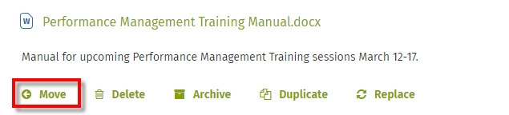
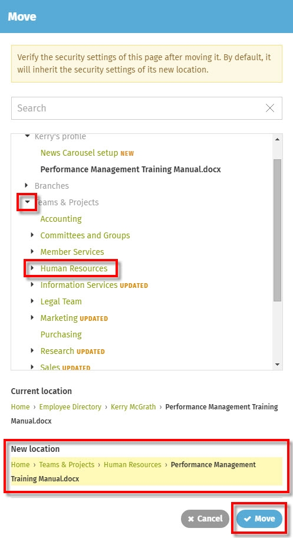
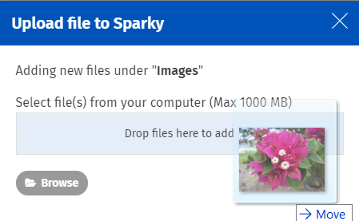

# Attach and reorder files

## How to attach & reorder files on a page

Use these instructions to attach files and change the order they appear in on a page. Uploading files to your intranet is quick and easy. You can use various sort options for reordering files and attach as many files to a page as you need to.  
  
File listings show a file type icon, file title and down arrow on the right. Depending on the size of the device you are viewing the document library on, you will see other icons in the file listing, like a download icon or a comments icon. Click the down arrow on the right of the file to view File Controls. You can sort files by curated order, title, type, date created, last updater, or size.

### Click "Upload file"

1. Click **Upload file**. This brings up the **Add file** pop-up window.   
   1. By default, document libraries appear in the center column of a page, but you may see this action in other columns.
   2. If you want to add a file to a folder, first click on the folder to expand it, then click **Upload file**.     
2. Click **Browse** to locate files on your computer. \(Or drag the files from another window and drop them in the **Drop files here to add** area.\)
3. Select the file\(s\) you want to upload and click **Open** in the file browsing window. Your files will appear on the page below **Add file**.

To select multiple consecutive files for upload hold down SHIFT while clicking on the files. To select multiple non-consecutive files for upload, hold down CTRL while clicking on the files.  
  
For more information on files and folders, see [how to create and manage folders](create-and-manage-folders.md).

## Sort files in different ways

On the top right of a document library, you will see a word indicating how the files are currently sorted. Available sort options are:

* **Curated**: a sort order set by a page editor or admin \(See Curated sort order below\)
* **Title**: file title
* **Type**: file type
* **Date**: date created
* **Updater**: name of last person to update file
* **Size**: file size

  
Click on the current sort option to open a menu of sort options. Click on the sort option that you want and the files will automatically re-sort. All sort options \(except Curated\) are available in standard and reverse orders. Click on the arrow to the right of the sort options to reverse the sort.  
  
To learn how to reorder images on a gallery page, see [how to add a photo gallery](../add-pages-and-sections/add-a-photo-gallery/).

## Curated sort order

Page editors and administrators can curate files or folders on a page into a particular order, and this curated order is the default that will display for users that visit the page. A curated order can provide an ease of access or use for certain files that may not be achieved by the other available sort orders. Users can still select a different order in which to view the files, even if a curated order has been set.

### Curate a document library

1. Find the document library you want to curate.
2. Click **...** beside the **Sort by** menu.     
3. Click **Curate** in the menu that opens.
4. In the **Curate files and folders** window, drag and drop files and folders into a new order.
   1. You can click on the **...** menu that appears when you hover over a file or folder and select **Move to the top** or **Move to the bottom** to bounce a file or folder to that place in the order.
   2. You can also click on \(Sort by\) **Curated** at the top of the window, and then choose to set the Curated sort by **Title** or **Date**.     
5. Click **Save**. The document library will now display in the Curated order.

### Curate a folder

1. Find the folder you want to curate.
2. Click the **down arrow** to the right of the folder name.
3. Click **Curate**. \(Depending on the column width, the Curate action may be found be clicking the **...** menu.\)
4. In the **Curate files and folders** window, drag and drop files and folders into a new order.
   1. You can click on the **...** menu that appears when you hover over a file or folder and select **Move to the top** or **Move to the bottom** to bounce a file or folder to that place in the order.
   2. You can also click on \(Sort by\) **Curated** at the top of the window, and then choose to set the Curated sort by **Title** or **Date**.
5. Click **Save**. The folder will now display in the Curated order.

### Remove curated order

When you remove the curated order, users will see the document library in their preferred sort order.

1. Find the document library you want to remove the curation for.
2. Click **...** beside the **Sort by** menu.
3. Click **Delete curation** in the menu that opens. The document library will revert to your preferred sort order.

To delete curation of a specific **folder**, click the **down arrow** to the right of the folder name and click **Delete curation**. \(Depending on the column width, the Delete curation action may be found be clicking the **...** menu.\)

## Move a file

Use these instructions to move a file to a different page, or into a folder. These instructions also work for moving a folder to a new location.

1. Navigate to the page the file is on.
2. Click the **down arrow** on the far right of the file name to open the **File Controls**.  

     

3. Click **Move** under the file title. The **Move** pop-up window will open.     
4. Click the triangle to the left of any page to show or hide its subpages and folders. Click on any page or folder listed in the pop-up window to move your file there.
5. Click **Move**. You will be taken to the page where the file is now located.

## View file preview

To view a preview of the file, click on a **file title**, to open the **File Editing Menu**, and then click **Preview**. In the window that opens, you see a small preview of the file contents for Word, PDF, PowerPoint, image and video files, and any comments that have been made on the file. If the file has more than one page, arrows appear at the bottom of the file preview so you can navigate the first few pages. You can download the file, or open it for editing, right from the file preview window. Video files can be played within the preview window.

## Hot intranet tips!

### **Drag-and-drop to attach files**

Use simple drag-and-drop to attach files to an intranet page - you don't even have to click Add file! This feature is easiest to use when you are working with two computer screens simultaneously. Note that this feature is not available when using Internet Explorer.

1. Navigate to the intranet page to which you want to attach the file.
2. Click and drag the file from your desktop or file browsing window and hover over the document library area of the intranet page you want to attach it to. \(Hover either over existing files on the page, or if there are no files, the area of the page where it says "Add file".\)     
3. The **Add file** pop-up will appear automatically. Hover over the **Drop files here to add** section, and let go of the file \(unclick\). The file will upload to the page automatically.

### **Follow files to be notified of changes**

If you want to be notified when a file is updated, or a file page is changed, follow the file. To follow a file, click the down triangle on the right of a file to expand the File Controls, and click the Follow icon \(a flag\). Or, click the Follow icon in the Page Sharing Buttons on the individual file page. When you follow a file, you'll receive in-app notifications when changes are made to the file. Depending on your profile settings, you may also receive email notifications. Learn more about [Following and Alerts](../basic-features/following-and-alerts/).

### **Name files for maximum findability through search**

People are much more likely to search on the intranet than on shared/network drives. This means a file's title is very important because people need to recognize the file without the context of folder names. Try to name files clearly so people will recognize them in search results.  
  
**Example**:

* **Do**: "_Memo on 2018 ThoughtSummit lunch options_" or "_Report on ThoughtFarmer webinar demographics, Q2 FY 11_"
* **Don't**: "_Lunch\_memo_" or "_Q2 demographics_"
* **The worst**: "_Mtg\_TF_"

