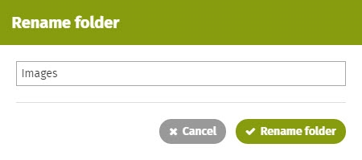
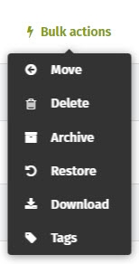

# Create and manage folders

### Use folders to manage your files

Need to manage a large number of files? Use folders to create a document library structure for keeping track of all your files. Use bulk actions to move, archive, delete, or download multiple files or folders at one time.

### How to create a folder

1.Click **New folder** above the files in the document library. The **Create folder** pop-up window will appear.

2.Type the folder name in the **New folder** field.  

3.Click **Create folder**. The new folder will appear.

If you have another folder selected/highlighted when you click **New folder**, the new folder will be created underneath the selected folder. To create a new top level folder, deselect the highlighted folder by clicking on the page somewhere outside of the file/folder listing.

### Upload a file into a folder

Add files from your computer directly into a folder on the intranet.

1.Navigate to the page with the folder on it and click on the folder name to select/open it.

2.Click **Add file** at the top of the list of folders/files.

3.Click **Browse**, find the file you want to upload and click on it.

4.Click **Open**. It may take a few moments to upload the file.

5.Once the file has uploaded it will appear underneath the open folder.

### Move a file or a folder

You can move files that are already on the intranet into a folder. See [how to move a file](attach-and-reorder-files.md) for complete instructions.

### Sort files in a folder

Whole document libraries as well as the files within a single folder can be curated into a particular sort order. To learn more, see [Attach & reorder files](attach-and-reorder-files.md).

### Edit security settings for a folder

You can change the security settings for the page the folder lives on to control who can view and edit the page and folder, but you can also edit the security settings of an individual folder.

1.Navigate to the page that the folder is on.

2.Click the **edit icon** \(a pencil\) to the right of the folder title to open the folder editing page.  

3.In the **Security** section on the right, click on **Security permissions**.

4.Edit the security settings as desired. \(For more information, see [how to change permissions to view and edit.](../security-settings-and-permissions/permission-to-view-and-edit.md)\)

5.If you wish to make the folder private \(only the page owner and intranet administrators can view\), select the **Private** checkbox on the right side.

6.When you're finished, click **Save**.

### Rename a folder

1.Navigate to the page the folder is on.

2.Click the **down arrow** on the far right of the file name to open the **File Controls**.

3.Click **Rename folder**. \(Depending on the column width, the Rename folder action may be found be clicking the **...** menu.\) The **Rename folder** pop-up window will open.  

4.Type in the new folder name.

5.Click **Rename folder**. The renamed folder will show.

### Delete a folder

1.Navigate to the page the folder is on.

2.Click the **down arrow** on the far right of the file name to open the **File Controls**.

3.Click **Delete**.

4.Click **Delete** in the **Delete** pop-up window to confirm the deletion. Files in the folder, as well as comments and links to it, will also be deleted.

### Make changes to multiple files/folders at once

Using the **Bulk actions** menu, you can move, delete, archive, restore, or download multiple files or folders at once. You must have edit permission for a file/folder to be able to apply a bulk action to it. If you have selected a file/folder that you do not have edit permission on, you will see the message "You do not have permission to \[change\] some of the items selected." In order to restore archived files or folders, you must have the option "Show archived content" selected in your settings.

1. To select multiple files and folders:

   a.To select multiple consecutive files/folders: Click on the first file/folder, then hold the SHIFT key and click on the last file/folder.

   b.To select multiple non-consecutive files/folders: Click on the first file/folder, then hold the CTRL key \(Command key on a Mac\) and click on each file/folder you want to select.

2. Click **Bulk actions** on the above the list of files/folders. This opens a dropdown menu.

3.Select the action that you want to apply to the selected files/folders. Follow the prompts to complete the desired action. \(See above for more information on moving a file or folder.\)

  

