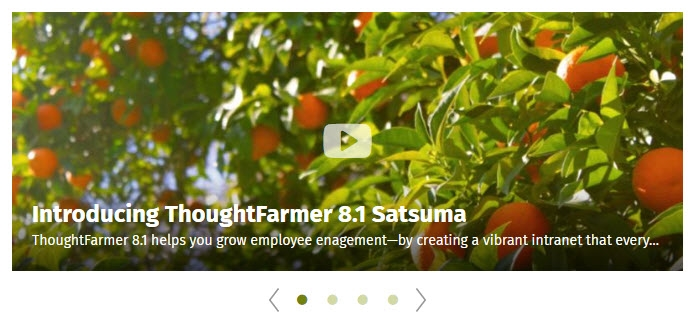

# Add Blog or News

### How to add a Blog or News page

Use these instructions to add a Blog or News page to your intranet. They are easy to set up and are great tools for sharing news, ideas and other types of information.

**Display subpages chronologically, as posts in middle of page**

By selecting the Blog/News content type you transform the way subpages appear. Instead of showing up only in the SuperNav on the left, or in a directory navigation on the page, subpages appear chronologically in the main column of the page.

On the left-hand side of blog and news pages you see a list of recent post titles; click on a post title to view the full post. You can use the page search in the SuperNav to search for a post. You can also filter posts by date \(via a list of months\), by post owner, or by tags \([learn about tags](../tags/)\).

**Difference between blogs and news pages**

* **Blogs show whole posts**: For each post, the title and full post show on the blog section main page. This makes it easy to read a full post, but can result in a lot of scrolling.

**•News shows excerpts of posts**: For each news item an image, the title, and an excerpt or summary of the post show on the News main page. This is more concise than a blog and the excerpts give the scent of the full post.

### First add a new page

1. Navigate to where you want to create the new page and click the **Add button** \(plus icon\) in the page header.
2. Give the page a clear title. It's a good bet to include either **Blog** or **News** in the page title.
   1. **Example**: _ThoughtFarmer Customer Care Team Blog_.
3. Click on the **Content type** dropdown on the right and select the **News/Blog** content type.
4. Click on the **Template** dropdown on the right, and select the desired template.
5. Select the radio button on the left for whether you want **News** or **Blog**. If you select **News**, choose whether to **Display thumbnail images** with the checkbox.

6.Click on **Security permissions** on the right under **Security** and make sure all the right people have edit permission on the page. \(See complete instructions on [how to change permissions to view & edit](../security-settings-and-permissions/permission-to-view-and-edit.md).\) Click **Done** when you are finished.

7.Click **Publish** and your Blog or News page will appear, ready for posts to be added.

### Lock this page feature

Once the content type News/Blog is chosen, a new option appears in edit mode - the checkbox **Lock this page**. If you check this box, people who have edit permission can still add new posts, but they are not able to make edits to the main news or blog page itself - it is "locked". Only the page owner can edit the news or blog page when it is locked.

### Add a Blog or News post

Adding a post to a Blog or News page is almost exactly the same as adding a basic page.

1. Navigate to the Blog or News page where you want to add a new post.
2. Click the **Add button** \(plus icon\) on the right of the page header.
3. Enter a title for your post in the **Enter a title** box.
4. Select the **Publishing details** that you want. \(See **Date options** heading below to learn about Publishing details.\)
5. Enter the **body content** of your post in the Rich Text Editor box.
6. Click **Publish** when you are done. Blog or News posts will show at the top of the list of posts.

### Add a gallery-style Blog or News post

You may want to have a Blog or News post that showcases images the same way that a Gallery page type does. Your intranet administrator may have created a Post template that includes a Photo gallery details card. If that is the case, select the appropriate template, and you are good to go. If not, follow these steps to create a gallery-style post. You will need to have permission to modify individual templates to follow these instructions.

1. Navigate to the Blog or News page where you want to add a new post.
2. Click the **Add button** \(plus icon\) on the right of the page header.
3. Enter a title for your post in the **Enter a title** box.
4. Click **Set up cards** on the right. The **Update cards** window will appear.
5. Click **Modify template** in the **Update cards window**.
6. Click the **plus sign** in the main column \(where you want to add the gallery\).
7. In the Card menu that opens on the right, click on the **Photo gallery details** card.
8. Click **Done** in the **Update cards window**.
9. Save the page.
10. Click **Add images** to add images to the gallery post. \(To learn more about adding images, see [Add a photo gallery](add-a-photo-gallery/).\)

For a gallery-style post to appear with an image in List or Grid View News, you need to add a Thumbnail image to the post. To learn more, see [How to add a Thumbnail Image](../edit-page-contents/add-thumbnail-images/)​.

### Date options when adding post or news item

When you follow the above instructions to add a post to a blog, forum or news section you will see three options that do not appear when you add other types of intranet pages.

* **Publish now**: Click this to set the official publish time and date as the moment you click **Publish** on the post.
* **Publish on**: Use this to set a future date, time and timezone for the post to publish and show at the top of the section. Or set a past date for a retroactive post. If you set a future date for the post to publish, the post will only be visible to the page owner and administrators until the time it is set to publish, when it will become visible to everyone with View permission on the post.

* **Sticky**: Check this box to keep your new post at the top of the section, even after it's not the newest post anymore. You can set a date for the post to stop being sticky, or just edit the page and uncheck the box when the post is no longer as relevant. To set a date, select the Sticky checkbox, then click on Always or the edit button that appears on the right. Click on the date and time that now show to bring up a calendar and dropdown menu for setting date, time and timezone for the post to stop being sticky.

### Play video in News Carousel posts

When you create a post that appears in a News Carousel on the intranet, video embedded in the post will appear in the News carousel. An image from the video will show in the News carousel post with a play symbol on it, indicating to the user that they can press play and watch the video right there within the News carousel.

### Hot intranet tips!

**\#1: Set up a meeting agenda & notes section**

Try using a News section to post and collaborate on meeting agendas & notes. This can help you wrangle multiple versions of meeting agendas and meeting notes with ease and show your stripes as a true innovator!

**\#2: Give the page a full, clear title**

"_Team blog_" No thank you!  
  
How many teams do you have at your company? How many team blogs could there be? Stand out and make it easy to find your blog, forum or news section by giving it a clear title that people will recognize.  
  
**Examples**:

* **Do**: "_Global Call Centers Blog_" or "_Fondue Machine Help Forum_" or "_Fjarðabyggð Office News_" \(Fjarðabyggð is the tenth largest city in Iceland!\).
* **Don't**: "_Office Blog_" or "_Help Forum_" or "_Latest News_."

