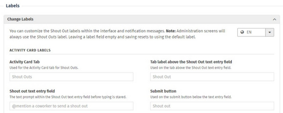
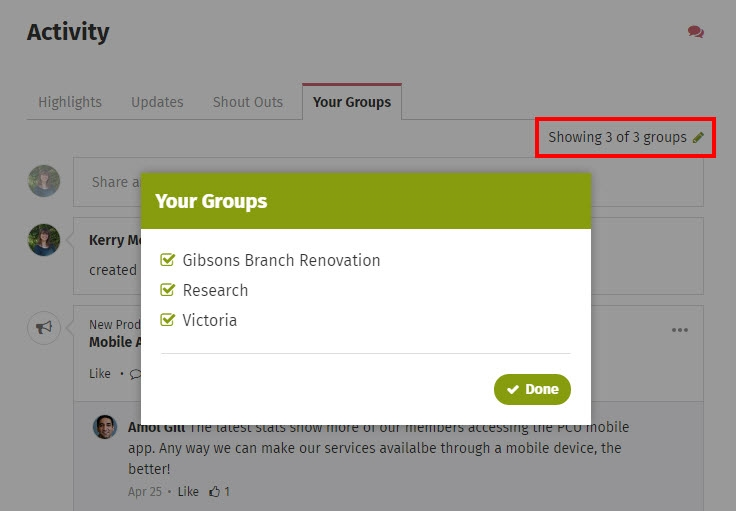
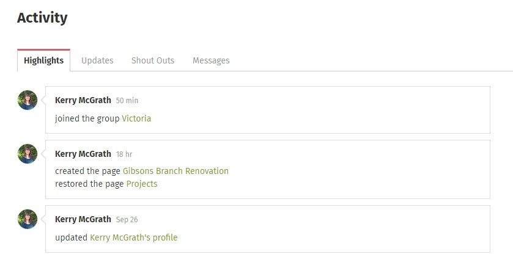

# Activity streams

### Discovering Activity on your intranet

Activity streams are a place where you can discover new activity on the intranet, join discussions by commenting, see what's happening in your groups, and post updates and shout outs to everyone or to a specific group. Activity streams can be found on the homepage, on profile pages, on group pages, and other content types.  
  
Your ThoughtFarmer intranet captures every single action on the site and shows it in an Activity stream somewhere. Activity Cards expose what people are working on and make it easier to discover important activities and keep up with changes.  
  
When you save a document to your shared drive, nobody knows about it. But when you update a file on your intranet, other colleagues can see the update. Plus, Activity streams offer an alternative way to find information.  
  
Not all employees can see all activity. The Activity people see is governed by their permissions on the intranet. If a colleague doesn't have permission to view one of your groups, then the colleague won't see updates you make to that group in any activity stream. \(See [how to change permissions to view and edit](../security-settings-and-permissions/permission-to-view-and-edit.md) for more information.\)

### Interact with the Activity stream

When someone posts an update or Shout Out, comments on a piece of content, or shares a page, it starts a whole new realm of interaction. Below an update, Shout Out, or page share in the activity stream, you'll see options to like the update/Shout Out or comment on it. Click on the three dots icon and a menu opens with options to Bookmark, Follow, Email or View the update. The most recent comments show below the activity item with an open comment box so you can contribute to the discussion.

### Homepage activity

The Homepage activity Card has four tabs - **Highlights**, **Updates**, **Shout Outs** and **Your Groups**. In **Highlights**, you see all the activity taking place on the intranet areas that you can view. **Your Groups** is a filtered view of Highlights, showing only activity that has taken place on your group pages and their subpages. **Updates**shows user updates that have been posted to everyone or to groups that you are a member of. **Shout Outs** shows Shout Outs that have been sent to everyone and to groups that you belong to.  
  
The Homepage activity, like the Homepage news, is unique to each user based on what content they can access, and what groups they belong to.

If new activity happens while you are on the homepage, a message appears just below the Activity tabs that says **New activity is available**. To view the new activity, click on the message to refresh the Activity Card.

### Your Groups tab on the Homepage

The Your Groups tab is found only in your Homepage Activity. It shows activity on the intranet that is particularly relevant to you because it's activity happening on the group pages that you are a member of. You'll see entries in the activity about updates and shout outs posted to your groups, newly created pages, attached files and more.

### Choose what you see in Your Groups tab

You can choose which groups you see activity from in the Your Groups tab in your Homepage activity. By default you will see activity from all of the groups you belong to.  
  
To change what you see:

1. Find the **Activity Card** on your Homepage.
2. Click on the **Your Groups** tab.
3. Click on **Showing \# of \# groups** on the right under the tabs. A pop-up window listing all of the groups you belong to will appear.
4. Uncheck the checkboxes beside the groups whose activity you do not want to see. Check the checkboxes beside the groups whose activity you do want to see.
5. Click **Done**. The number of groups showing activity will automatically update.

You can choose to see activity from a group again at any time.

### Activity on profile pages

Your profile page has an Activity Card that shows activity you have performed, updates that you have posted, and messages that have been sent by you or to you. There are four tabs on your Profile Activity - **Highlights**, **Updates**, **Shout Outs** and **Messages**. The **Highlights** tab shows all your activity, not including updates or messages. It includes pages you've created and edited, files you've uploaded or updated, comments added to pages you've created, and more. The **Updates** tab contains all of the updates or page shares you have posted to everyone, to a group, or as a message on someone else's profile page. The **Shout Outs** tab contains Shout Outs that you have sent, and Shout Outs you have commented on. The **Messages** tab contains all messages left on your profile page by other users and message you have sent to other users.

As on the homepage, people can Like, Comment, Bookmark, Follow, Email and View activity items, updates, Shout Outs, page shares and messages on your profile page.  
  
Everyone's profile page shows their Activity, Updates, Shout Outs and Messages. When you go to a colleague's profile page you can see everything your colleague has been working on. This means you can navigate to updated content by people rather than the navigation structure.  
  
**Example**: If you know that Chris recently updated the meeting agenda for tomorrow but you don't know where it is on the intranet, just go to Chris' profile page and browse his activity stream.  
  
You can also leave a message for someone on their profile page in the Messages tab, but be aware that these messages are not private and can be viewed by everyone.

### Group pages

The Activity Card on a group page has three tabs - **Highlights**, **Updates** and **Shout Outs**. **Highlights** includes all the activity that has taken place on the group page and its subpages, including Updates. **Updates** shows all updates \(including page shares\) that have been posted specifically to the group. **Shout Outs** shows Shout Outs that people have sent to the group.

### Activity on other pages

Activity Cards may or may not be present on other content type pages. When an Activity Card is on another content type, all activity from that page and its subpages shows under the **All Activity** heading. You can view all of the activity, contribute to discussions by adding comments from the Activity Card, and Like, Bookmark, Follow or Email pages or files that have discussion activity happening on them.  
  
If there is no Activity Card on a page, you can still view activity on it. Activity can be viewed by clicking the **down arrow** on the right of the page header to open the **Page Controls**, and clicking on **View Activity**. The **All activity** pop-up window will open displaying all activity for that page and its subpages. Use the arrows at the top or bottom of the window to navigate through past days' activity. To return to viewing the page, click **Close** at the bottom of the window.  

