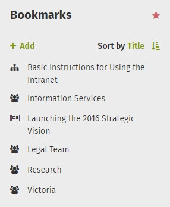
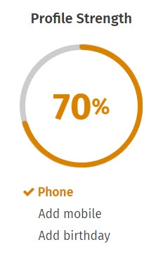

# Bookmarks

### Bookmark any intranet page with a click

Use Bookmarks on your ThoughtFarmer intranet to access important pages quickly and keep up-to-date with changes. You can add any intranet page to your list of Bookmarks with just one click.

### How to add a bookmark

Navigate to the page you want to add and click the Bookmark icon \(a star\) in the Page Sharing Buttons in the page header. When you click the Bookmark icon, the icon is filled in to show that you have bookmarked the page. That's it!

Now you can click on **Bookmarks** in the Application Toolbar and you will see the page you have bookmarked in your list of bookmarks. \(If both are enabled, Bookmarks and History live in the same menu in the Application Toolbar. The Toolbar remembers and displays the last tab you used, so you may have to click on **History** to access the Bookmarks tab.\)  

The number under the Bookmark icon indicates how many people have bookmarked the page. Hover over the number to see a pop-up list of people who have bookmarked the page. Click on the number to see a list of the people who have bookmarked that page, with their profile photos.

### Bookmark a page from Activity stream

When an update, Shout Out or other content in an Activity stream has the three dots icon beside it, you can bookmark the page right from the Activity stream. Click the **three dots icon** on the top right of the Activity item. In the menu that opens, click **Bookmark**. The content or update page will automatically be added to your Bookmarks.

### Bookmarks can trigger in-app and email notifications

In your Profile Settings you can choose whether Bookmarking a page means that you will automatically follow the page. When you Follow a page, you receive in-app notifications when changes are made to the page. If you choose to automatically Follow pages that you Bookmark, then you will receive notifications when changes are made to pages that you have Bookmarked. \(Learn more about [Following and alerts](../following-and-alerts/).\)  
  
To change whether Bookmarking a page results in you getting notifications from the page:

1.Click on the **Alerts** menu in the Application Toolbar.

2.Click on the **Notifications** tab.

3.Click on the **gear icon** in the bottom right of the Notifications tab. This will take you to your Profile Settings. \(You can also access this page by opening the Page Controls on your profile page and clicking **Settings**.\)

4.Under **Notification Settings: Auto-follow**, find the checkbox **Content you bookmark**, and:

1. Select the checkbox to automatically Follow when you Bookmark pages.
2. Deselect the checkbox to Bookmark pages without Following them.

5.Click **Save** at the bottom of the page.

### Bookmarks Card on Home page or profile

If it is used on your intranet, you may also find your Bookmarks in the Bookmarks Card - available on the homepage or your profile page.  

### Edit profile to make Bookmarks Card private

If the Bookmarks Card is enabled on profile pages on your intranet, by default it is visible to any colleague who visits your profile page. But you can set your Bookmarks to private so only you see them.

1.Click on your name or profile photo on the right of the Application Toolbar, and click **Edit profile** in the dropdown.

2.In edit mode, click **Configure profile cards** on the top right.

3.In the Card Setup window that opens, find the **Bookmark manager** card.

4.Uncheck the box **Allow other to view** to hide your Bookmarks from other users viewing your profile page.

5.Click **Done**.

6.Click **Save** at the bottom of the page.

### Add an internal or external Bookmark from Bookmarks Card

If the Bookmarks Card is enabled on your homepage or profile page, you can use it to add intranet pages, external websites, emails, or SharePoint documents to your intranet Bookmarks. Once you add them they show up in your Bookmarks in the Card and on the Application Toolbar.

1.Find the **Bookmarks Card** on your homepage or profile page.

2.Click **Add** below the Bookmarks heading. This will open a pop-up window for adding a link.

3.In the pop-up window, select the **tab** for the type of Bookmark you want to add and select the **Bookmark**. The tab options are:

**a.\(Your Intranet Name\)**: Use the Search bar or the tree navigation to find the intranet page you want.

**b.Recently viewed pages**: Look at list of pages you have viewed recently to find the intranet page you want.

**c.External location**: Enter the URL of the website you want to Bookmark in the Location box.

**d.Email**: Enter the email address that you want to create a mail-to Bookmark for.

4.Type the name you want to show in your Bookmarks list in the **Link text** box at the bottom of the window.

5.Click the **Insert** button. Your Bookmark will show up in the Bookmarks Card and your Bookmarks menu.

  

