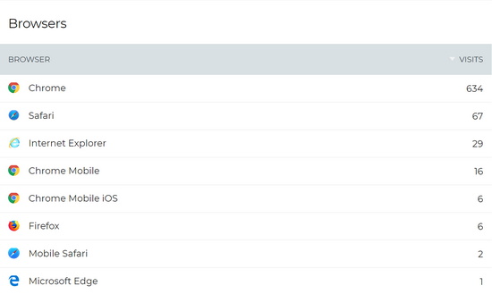

# Rename and delete Bookmarks

### How to rename a Bookmark

Use these instructions to Rename a Bookmark from the Bookmarks list on the Application Toolbar, or from the Bookmarks Card on your homepage or profile page.

1. Hover over the name of the Bookmark you want to change, and click on the **three dots** to the right of the name.
2. In the menu that opens, click **Rename**.

3.The Bookmark name becomes a text box that you can edit. Change the name of the Bookmark.

4.Click **Save**.

### How to delete a Bookmark

Use these instructions to delete a Bookmark from the Bookmarks list on the Application Toolbar, or from the Bookmarks Card on your homepage or profile page.

1. Hover over the name of the Bookmark you want to delete, and click on the **three dots** to the right of the name.
2. In the menu that opens, click **Remove**.

3.Click the **Remove** button to confirm that you want to delete the Bookmark.

