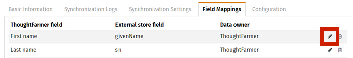

# Comments and notifications

### Comments trigger notifications

Once you post a comment, people that follow the page will receive an in-app notification, and depending on their settings, an email alert. Page followers may include the page owner and people who have edited, commented on, or bookmarked the page. If you have chosen in your profile settings to follow pages that you comment on, you'll start to receive notifications after you add a comment on a page. This makes it easy to keep up with discussions and changes to pages you are collaborating on. \([Learn about following and alerts](../following-and-alerts/).\)  
  
Email alerts for comments are sent out after the two minute [comment edit window](edit-and-delete-comments.md) has ended. So if you need to make multiple changes to your comment after posting it, an email alert is only sent after the two minute window has passed and the comment is finalized.

### @mentions in comments

You'll also receive an in-app alert when someone mentions you in a comment. A **Mention** is when someone types **@Yourname** or **@Groupname** in a comment, page body, or Rich Text Editor to bring something to your attention. When your name, or the name of a group you are a member of, is mentioned, a new alert will show in your Alerts menu on the Application Toolbar, under the **Mentions** tab. Click on the alert in the Mentions tab to be taken to the page or comment where you or your group was mentioned.

### Click Unfollow icon to stop email alerts

To stop receiving email alerts on a specific page where you have left a comment, navigate to that page and click the **Follow/Unfollow icon** \(a flag\) in the Page Sharing Buttons in the page header to Unfollow the page.  

To stop receiving emails when comments occur on pages you follow, click on the **Alerts** menu, and click on the **gear icon** at the bottom right of the **Notifications** tab. On the Profile Settings page that opens, under the **Email** heading, deselect the **Comments occur** checkbox.

### Hot intranet tip

**Add comment by replying to notification email**

You receive email notifications when people add comments to pages that you follow, if you have chosen that in your profile settings. When you receive an email notification with a comment in it, you can add a comment to the page by replying to the notification email. Hit reply, type your comment, and send the email. Your comment will appear on the page, keeping the flow of conversation going!

