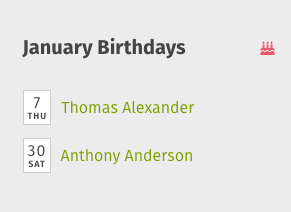

# Home page features & layout

### Meet your personalized intranet homepage

Your ThoughtFarmer intranet homepage has been designed by ThoughtFarmer and customized by your organization to keep relevant information front and center, and to help you do your work more easily. Your homepage includes personalized News, Activity and links meant just for you. Nobody sees the same homepage that you see, because it is tailored specifically to you.

### What features are on my homepage?

Every ThoughtFarmer homepage is unique, depending on how your organization has set it up; but every homepage is made from similar components. Because your intranet administrator has customized your intranet to your organization, your intranet homepage may not display all of the features described below.

### Application Toolbar

The Application Toolbar is the bar at the very top of your homepage, and it stays at the top no matter what intranet page you are viewing. The menus and links in the Toolbar are really useful in navigating the intranet - you'll find pages that you've bookmarked, pages you've visited recently, a list of your group pages, Alerts to activity on pages you follow, Search, links to your profile and more. [Learn more about the Application Toolbar](application-toolbar.md).

### Main Navigation Bar

The Main Navigation Bar extends across the page just below your intranet name or logo. It contains links to some of the top level pages on your intranet - those main pages that you start out on when delving into intranet content. You'll likely find a link to your Employee Directory in the main navigation bar, and some intranets have a link to a Group Directory as well. Depending on the settings on your intranet, the Main Navigation Bar may also have links to your homepage and profile page.

**Mobile devices**

The Main Navigation Bar shows on tablets, but is not displayed on smartphones. On smartphones, use the Application Toolbar and Left Navigation Card to navigate through the site. Tap the hamburger icon \(three horizontal lines\) on the left of the Application Toolbar to open the Left Navigation Card.

### Left Navigation

On the homepage, the Left Navigation Card is a simple treeview navigation that you can use to navigate through your intranet. Some organizations choose to hide the Left Navigation Card from the homepage when viewed on a desktop computer. When you navigate to other pages, the Left Hand Nav becomes the SuperNav, capable of much more than a simple treeview navigation! \([Learn more about the SuperNav](../search/use-the-supernav.md).\)

**Mobile devices**

Depending on the size and orientation of tablets, the Left Navigation Card may display or be hidden. On smartphones, the Left Navigation is always hidden. To access it on either type of device, tap the hamburger icon \(three horizontal lines\) on the left of the Application Toolbar to display it. Tap the X on the left of the Application Toolbar to hide it again.

### Recent News

Included in the Recent News are both news stories targeted at all employees and personalized news stories just for you. The personalized stories are fed by the group pages you are a member of. Click on the News posts to read the whole story and keep current with what's happening in your organization. \([Learn more about News features](news.md).\)

### Activity

In the Activity stream you can keep up-to-date on activity happening all over the intranet. The **Highlights** tab lets you know when pages are created, files are added, comments and Shout-outs are made and more. The **Updates** tab shows updates your colleagues have shared with everyone or with groups that you belong to. The **Shout-outs** tab shows Shout-outs sent to everyone and Shout-outs sent to groups you are a part of. The **Your Groups** tab shows activity specifically related to groups you are a member of. The Activity stream is interactive, allowing you to Like, Bookmark, Follow and Share activity items, and join discussions by commenting right from your homepage. \([Learn more about Activity streams](activity-streams.md).\)

### A variety of Cards

Cards are the basic building blocks of all of the pages on your intranet, including the homepage. The Left Navigation, News and Activity described above are all individual Cards, or page features, but there are many more. Your homepage can be a mixture of any or all available Cards, and your organization may have custom Cards not listed here. \([Learn more about Cards](cards.md).\)  
  
Below we've given a brief summary of some of the Cards you may see on your homepage.  
 

* **Birthday:** Displays birthdays occurring in the current month for users who have added their birthday to their profile.

* **Bookmarks:** Displays a list of pages that you have bookmarked. This Card contains the same information that is found in the Bookmarks menu on the Application Toolbar. You can add, rename and remove bookmarks from the Bookmarks Card. \([Learn more about Bookmarks](bookmarks/).\)

  

* **Poll:** Displays the selected poll, and allows users to vote on the poll. Once you vote, the Card displays the current results of the poll.

* **Location:** Displays information entered about a location's address and contact info, and a map if desired.

* **Mini Calendar:** Displays a mini calendar month indicating days that have events scheduled. Events come from a calendar page elsewhere on the intranet. Today's or the selected day's events show with the Mini Calendar.

* **News Carousel:** Another way of displaying Recent News, in a rotating carousel of News items.

* **Photo collection:** Displays a sampling of photos from an existing photo gallery on the intranet.

* **Quick links:** Displays handy links to intranet pages, external website pages, or emails added by your intranet administrator.

* **Random quote:** Displays random quotes added to the Quotes page by intranet users. Every page refresh shows a different quote, and you can click the arrows to navigate through the quotes.

* **Rich text:** Anything you can add to the Rich Text Editor you use when editing a page can be displayed in a Rich Text Card.
* **Custom Cards:** There are many possibilities for other things that your intranet administrator could add to your homepage in a Custom Card!

#### Hot Intranet Tip

**Click intranet logo to go to the homepage**

Need to get back to your homepage? Click on your intranet logo in the site header to return to the homepage in one step!

