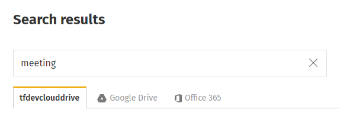

# Search cloud drives

Cloud drive integration on your ThoughtFarmer intranet allows you to search for files and folders in your cloud drives \(eg. Google Drive, Office 365, SharePoint Online\) while at the same time searching for content on your intranet.If enabled, cloud drive search results will appear both in the Find-as-you-type search results that dropdown from the search bar, and in search results on the main search page.

### Find-as-you-type search

When searching from the main search box, ThoughtFarmer will automatically search the intranet and any integrated cloud drives when you briefly pause typing. Search results show up in a dropdown menu and you can navigate to results without having to go to the search results page itself.

Intranet search results will show at the top of the search results dropdown, and cloud drive search results will show below them under a different heading. The default number of cloud drive results that will display is 5, but your intranet administrator may have changed it to display a different number of results.  
  
If you are not logged in to your cloud drive account, a message will display that you are not logged in and prompt you to log in. Clicking Log in to \(cloud drive name\) will open the cloud drive account login window. After logging in, you will see the search results from the cloud drive.  
  
Find-as-you-type search results will also display cloud drive search results on mobile devices, but you may have to scroll down the results menu to find them.

### Cloud drive search results

On the main search results page, cloud drive search results can be viewed in rows in-line with intranet search results, or in separate tabs for each cloud drive. In the All tab, which shows both intranet and cloud drive search results, several intranet search results will show before the Cloud Drive card rows are displayed.  
  
**Cloud drive results in line with intranet search results**

**Search results from the intranet and cloud drives can be viewed in separate tabs**

If you are not logged in to your cloud drive account, a message will display in the card row, prompting you to log in to the account to see search results. Clicking Log in to \(cloud drive name\) will open the cloud drive account login window. After logging in, you will see the search results from the cloud drive.

Search filters on the left of the main search results page can only be used to filter intranet search results. If search filters are applied to the search results, cloud drive results will disappear from the main tab. If search filters that have been applied are cleared, cloud drive results will reappear in the search results. If a cloud drive search results tab is selected, the filters will disappear from the search page.

A user can choose to hide a card row of cloud drive search results from the All tab on the search results page. If a user selects "Hide" on the cloud drive search results card, that setting will be remembered and results from that cloud drive will not show in the user’s All search results tab in future. The user can still view search results from that cloud drive by selecting the tab for that cloud drive.

If a user wants the cloud drive results to show again in the All results tab, the user can select “Show results on All tab” under the Cloud drive results tab.

