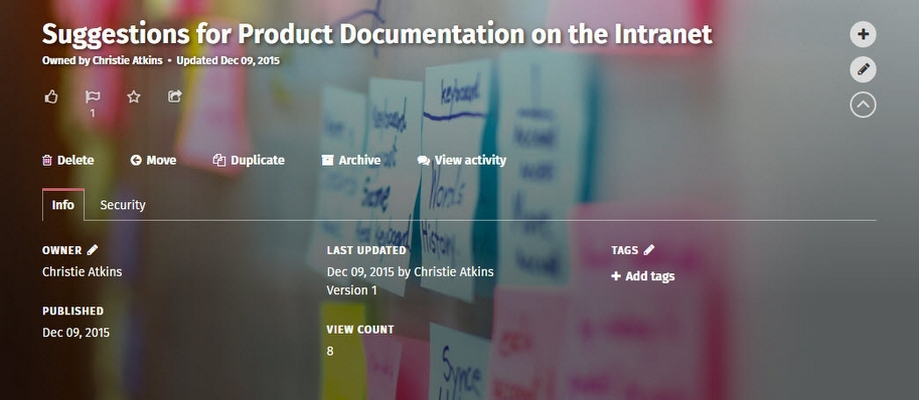

# Edit page contents

### How to edit the text, images, etc. on pages

Use these instructions to edit the text and graphics on pages and control page versions. You can easily insert hyperlinks, images, video and other multimedia from the web, delete pages, and view a page's version history.  

Editing a ThoughtFarmer page is like editing a Microsoft Word document. You can format text using headings, font sizes, bullets and numbering. It's easy to insert an image in a page or embed a video or other content from another website. You can also create simple tables on a page. Every time someone edits and saves a page, your ThoughtFarmer intranet creates a new version of the page so you can see exactly what changes were made.

### Edit page tour

The first time you add or edit a page, a tour prompt will appear giving you a quick introduction to the different parts of the edit page. The Edit page tour can be accessed at any time in edit mode by turning the **Tour toggle** above the page header ON and clicking the circles that indicate areas described on the tour.  

### Only one person can edit a page at a time

Only one person at a time can edit a page on the intranet. If you try to edit a page that someone is already editing, a message will appear telling you who is currently editing the page. Click on the name of the person editing the page to view their profile page and contact info, so you can contact them if you want to know when they will be done with the page.

### Page Controls have page actions

Click the down arrow on the right of the Page Header to access the Page Controls. Page Controls is an expandable section with lots of page actions available - move, archive, delete or duplicate a page. You can also view page information, security permissions, and activity \(on some pages\), and add tags to the page.

### How do I?

* [Insert links to other pages](insert-links/)
* [Insert images \(photos\)](insert-images.md)
* [Add a page header image](add-page-header-images.md)
* [Add a Thumbnail image](add-thumbnail-images/)
* [Modify gallery photos](modify-gallery-photos.md)
* [Embed video \(maps, forms, etc.\)](embed-forms-widgets-and-more/)
* [Insert & edit tables](insert-and-edit-tables.md)
* [Use version control](version-control.md)
* [Reorder & move pages](reorder-and-move-pages.md)
* [Export to PDF or Word](export-to-pdf-or-word.md)
* [Email a page](email-pages.md)
* [Share page with a group](share-pages-to-a-group.md)
* [Print a page](print-pages.md)
* [Archive and delete a page](archive-and-delete-pages.md)
* [Restore a page](restore-or-undelete-pages.md)
* [Add a custom news post intro](custom-news-post-intro.md)
* [Add an abbreviated page title and summary](add-abbreviated-page-title-and-summary.md)
* [Use the Rich Text Editor](rich-text-editor-and-spell-check.md)

### You might also enjoy...

If you found these instructions helpful, or you're looking for something similar, these pages might be helpful:

* [How to change view & edit permissions](../security-settings-and-permissions/permission-to-view-and-edit.md)
* [How to add & delete tags](../tags/add-and-delete-tags.md)
* [How to import an MS Word doc as a new page](../add-pages-and-sections/import-a-word-document-in-a-page.md)
* [How to create a page with multiple language versions](../languages-and-translation/create-multilingual-page.md)
* [How to add a link to the navigation of a page](../add-pages-and-sections/add-link-in-navigation.md)

