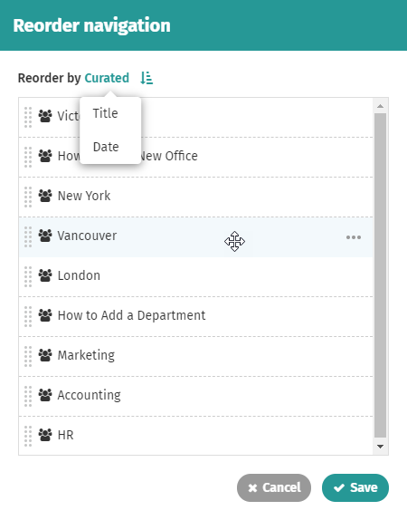

# Reorder and move pages

### How to reorder pages and move pages

Use these instructions to change the order in which subpages are listed or move a page or file from one location on the intranet to another. Through a simple drag-and-drop pop-up window you can reorder pages. And with just a few clicks and zero page editing you can move a page or file to a new location.  
  
When you move a page all the subpages and attached files move with it. This means you can move entire sections in one fell swoop.  
  
Moving or reordering pages will not break links to those pages. Each page on your ThoughtFarmer intranet is created with a unique and permanent URL that doesn't change when you move it or change page order \(or change a page's title\).

### Click "Reorder navigation" to change page order

To reorder pages you must be on the page above the set of pages you want to reorder. This is called the "parent" page on which all the subpages live as "sibling" pages.

1. Navigate to the parent page of the pages you wish to reorder. \(Don't go into edit mode.\)
2. Click the **down arrow** on the right of the page header to open the **Page Controls**.

3.Click **Reorder navigation**. This brings up the **Reorder navigation** pop-up window.

4.Click on the page title to drag-and-drop the images into the order you want, or

5.Click on the current sort order beside **Reorder by** at the top of the window, and select a new sort order. You can sort by Title or Date. Click the arrow beside the sort order to reverse the order, or

6.Hover over a page in the list, click on the three dots on the right and select **Move to the top** or **Move to the bottom** for that page.

7.Click **Save**. The page will reload with the subpages displayed in your newly selected order.

### Click "Move" to change the location of a page

1.Navigate to the page you want to move.

2.Click the down arrow on the right of the page header to open the Page Controls.

3.Click **Move**. This brings up the **Move** pop-up window.  

i.Click the triangle to the left of a page to show or hide its subpages.

ii.Click on any page listed in the pop-up to move your page there. **OR**

iii.Start typing the title of the page that you want to move the page under in the **Search** field. Click on the page you want when it appears in the dropdown.

4.Click **Move**. The page will reload in it's new location and you will see the updated location in the SuperNav on the left.

You can also move a page while in edit mode. Click **Move** at the top of the edit page beside the breadcrumb trail, and then continue with **Step 3** above.

When you move a page, the page inherits its security settings from its new parent page. So after moving a page, check its security settings to see if you need to change them.  
  
For instructions on moving a file, see [how to move files](../add-and-edit-files/attach-and-reorder-files.md).

