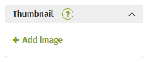

# Build a form Page

Form pages are exactly what they sound like - a form that exists within an intranet page. Setting up a Form page is very straight forward. You can build a Form Page using an existing form, or by creating a brand new form for the page.

### Create a Form page

Navigate to the area you want to add the form page and click on the Add icon \(+\), just like you were adding any other new page.  
  
Enter the title of your page.  

In the body area, enter any instructions or introductory information you would like to appear above the form on your new page. 

Under Content type, select Form from the drop down.  

To import an existing form, just search for the form title under Find a form and select the correct one from the results. It is strongly recommended that you build the form first and import it into a Form Page.

The page will import the form data from the original form. The form is now associated with the page

If you must build a new form within a new Form Page, click on the “+ Or build a form and add it to the page”

1.A pop up will appear to let you know that the Form page will be saved as a private page until your new form is built and launched.

Click on Build to accept and launch the form builder

2.Create your new form by adding form elements and copy until your form is complete

### Form layout options

#### Form

To make the form submittable on the page, select the Form option under Layout.  

#### Entries

The other two layout options, Entries in list and Entries in grid, will display the form entry data rather than the form itself. This makes the data consumable by a specific audience, rather than displaying a completable form.

List layout will display a table with the form entries in each row, that can be sorted by columns.  

Grid layout uses cards, displaying one card per piece of form entry.

No matter which layout you choose, there are defaults that you can adjust according to your needs

There are several defaults you can adjust:

1.The number of displayed entries is defaulted to 20, but you can increase or decrease the number to suit your data presentation needs.

2.Next, there is an option to allow form submitters to create new form entries. By default, this option is not selected. If you want to allow end users to add form entries, check the box. When it is checked, it will display a “Create entry” link in the form.

There are also content defaults. In both List and Grid views, the default form fields are:

* Title
* Status
* Assigned to
* Submitted by
* Date submitted \(Form entry creation date\)
* Due date

These fields can be adjusted by selecting other available options \(including other form fields used on the form\) from the drop downs.  

Grid layout has a few information options that List layout does not:

1. Every field will have a "Show label" checkbox.
   1. By default this is not checked. Checking it will display a label for the field in the form entry card.
2. Every field except an Image upload field will also have a "Larger text" checkbox.
   1. By default this is not checked. Checking it will use larger text in the form entry card.
3. Image upload fields will have a fill/fit toggle.
   1. Selecting fill will crop the image so that it fills the entire image area on the form entry card.
   2. Selecting fit will resize the image so the entire image is diplayed on the form entry card.
4. Images uploaded to an Image upload field will be displayed in the form entry card.
   1. Clicking the image will open the image in a new tab.
5. Images uploaded to a File upload field will not be displayed. Instead the filename will be listed in the form entry card.
   1. Clicking the filename will download the image.

#### Form entry filters

Any fields \(with the exception of Time and File Upload fields\) that are added to the Information Display will be treated as Filters when viewing Form entries. Here are some basic rules on how the Filters behave:

1. Any fields already being used in the current view are excluded since they are already being used as a filter \(The status field is an exception to this rule\).
2. Text, Paragraph, Number, Email, Website fields show a search box.
3. Submitted by and Assigned to fields display names with counts and are ordered with the person with the highest count first. If users have the same count they are ordered alphabetically. Up to 10 users are displayed at a time, if there are more than 10 users, a search box is displayed.
4. Dropdown, Radio, Checkbox fields show the choices with their counts. They are ordered by the choice with the highest count first or, if multiple choices have the same count they are listed alphabetically.  
5. Date fields show the display picker.
6. Status fields show the different workflow statuses with counts. They are ordered by highest count first, or if multiple statuses have the same counts they are ordered alphabetically.
7. If a status field is used in the view, it will also show up as a filter category.
8. Only statuses that are related to the status field should be displayed. For example, if the current view is Open entries then all initial and in progress statuses will be displayed as filters. If the current view is Closed entries then only final statuses would be displayed as filters.
9. If there is only 1 status that can be used as a filter then the status filter will be hidden. For example, if there is only 1 open status \(the initial status\) then the status filter will be hidden.

Once you are satisfied with the content of your form, you are ready to complete your page setup.

#### Form page settings

Adjust your page settings just as you would adding any other new page:

1.Add a thumbnail.

2.Set your publishing options.

3.Adjust your Security settings if desired. Keep in mind that anyone with permissions to the form will also need to be added to the page permissions in order to access the page. If someone that has access to the page but does not have access to view or submit the form, they will not see it on the page.

4.List your tags.

Once you are happy with the way your new page is set up, click Publish to make it live!

