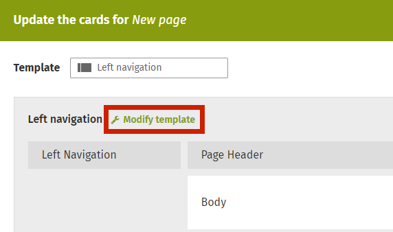

# Create a Form Card

Let users add existing forms to their pages by creating form cards. Form cards are just like any other content card - they are the building blocks of a new page. In the case of Form cards, they will allow the page creator to add, but not modify, an existing form to a new content page.

Form cards can be created one of two ways:

1. Create or modify a global template to include a form card \(note that this option is only available to administrators\) 
2. Create a new page and modify the template to add a form card only to that specific page \(note that this option is only available to users that have Modify Template privileges\).

This guide will cover both methods.

### Create or m

Let users add existing forms to their pages by creating form cards. Form cards are just like any other content card - they are the building blocks of a new page. In the case of Form cards, they will allow the page creator to add, but not modify, an existing form to a new content page.

Form cards can be created one of two ways:

1. Create or modify a global template to include a form card \(note that this option is only available to administrators\) 
2. Create a new page and modify the template to add a form card only to that specific page \(note that this option is only available to users that have Modify Template privileges\).

This guide will cover both methods.

### Create or modify a global template to include a form card

1. In the top navigation menu, click on your name and open the Administration Panel. 
2. Under User Interface, select the Content Type Templates.
3. The templates are organized by category according to their function \(e.g. Page, Group, Forum etc.\)
4. If you are modifying an existing form template, locate the form from the list. Hover your cursor over the template until a pencil icon appears and click on it to open the Template Editor. 

### odify a global template to include a form card

1. In the top navigation menu, click on your name and open the Administration Panel. 
2. Under User Interface, select the Content Type Templates.
3. The templates are organized by category according to their function \(e.g. Page, Group, Forum etc.\)
4. If you are modifying an existing form template, locate the form from the list. Hover your cursor over the template until a pencil icon appears and click on it to open the Template Editor

5.If you are creating a new template, locate the category that applies to the new template and click Add New to open the Template Editor.

6.The Template Editor has three major sections: Page layout options; template name and language, and template content.

7.If you’re modifying an existing template, you can skip to step 9. If you are creating a new template, you will have to build it from scratch.

8.To create a new template, complete each input area

1. Page layout - select how many columns you want for your new template \(typically you’ll have a selection of two or three columns to choose from\).

2.Enter the name of your new template in the content box, and select the template language from the drop down \(it is defaulted to English\).

3.Build your template content by adding different cards. All templates will have the Body, Comments, and Document Library cards already built by default, but you can add additional cards if you want. In the column you wish to add content, click on + **Add Card** to open the card picker and select the option you want.

9.Decide where you want the form card to appear in the template. You can add them to whichever column you want.

10.Click on + **Add Card** and either search for, or scroll through the list, to find the Form card and click on it.  

11.You can reorder your content cards by dragging them up or down the list, or between columns.

12.Once you are satisfied with your template, click **Save** to publish and make it available to users.

### Create a new page and add a form card by modifying the template for that page

1. Create a new page the way you would normally.
2. To the right of the page, under Content type & template, select the template you want to use for your new page.

3.In the same modal, click on Set Up Cards to display your available card options.

4.In the Update cards window, click Modify template to be able to add Cards.

5.Click on the + Add Card button and select the Form card to add it to your list of available card options.

6.Locate the Form card in your available list, and click on either Set Up or the cog icon to open the editor.

7.Search for the form you want to add to your page, select one from your options and click update.

8.Click **Done** to return to the main page setup screen.

9.The form will not display in the setup screen. You can see it after Publishing your page.

10.Add your remaining page content and complete your page setup the way you would any other way. Publish when ready!  

