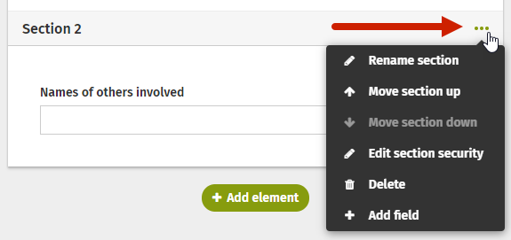

# Create Form sections

As a default, all draft forms are initially set up with one section but you can add additional sections. Each section can have its own security settings, allowing you to customize which viewers can see or respond to different sections of your form.

* Start creating your new form the same way you would any other form.
* To create multiple sections, simply drag the Section break button from the Form elements menu, and drop it into your workspace. That will immediately create another section.

* If you so desire, you can name each section. These names are for your reference only and will not be viewable on the completed form. Naming a section also makes it easier when you are setting up any associate form logic.

* You can add all of your sections first if you know how many you’ll need, or you can add them as you build your form - there’s no wrong way to add them into your form!
* Form elements can be added to any section you have built. They can also be re-ordered into different sections by using the navigation arrows within the field

* In each Section header, there is a set of ellipses. Click on these ellipses to open the Section menu.

* The Section menu contains all of the editing options you have for a particular Section. It allows you to:
  * Move a specific section up or down in your form order
  * Edit the security settings for that particular Section
  * Delete the Section entirely - this will also remove any fields you have added to this section
* Selecting the security settings option will open the options pop-up. In the pop-up you can specify who can view and/or edit the specific Section. Just click the slider to turn different options on or off.
  * **Version 9.3+**: View and edit permission for the section can be restricted to specific Reviewers. Click in the Enter names box under Reviewers, and start typing the name of the group or person you want to be able to review that section. Click on the name when it appears in the dropdown. If you leave the Enter names box blank, all Reviewers on the form will have the Reviewer permissions that are set for the section.

* When you’ve set your security permissions, click Save to save your changes and return to your draft workspace.
* Continue to build your form until you are ready to Preview and Launch.

An additional way to separate content is to create a table within a form. To learn more, see the page [Insert a table into a Form](insert-a-table-into-a-form.md).

