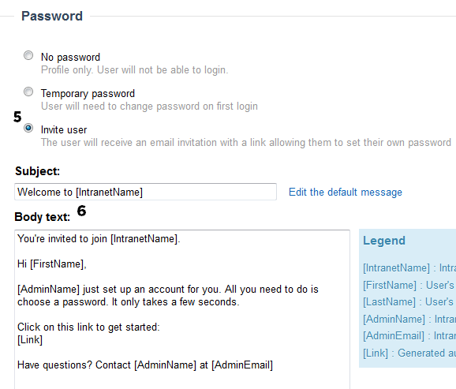

# Form permissions

Any form created with FormFlow has 4 different levels of permissions, based on form usage:

1. Submitters
2. Reviewers
3. Viewers
4. Form Managers

Each of these permission classifications has its own set of options that you can change at any time, from the Permissions tab located in the top menu.

There is also an additional option to include form entries in search results for people with the correct permissions.

### Permissions for Submitters

Submitters are any users that can submit entries to the form. Submitters can only view their own entries. Here are all the different permissions you can set for Submitters:

1. The Submitter field indicates who can create entries for the form. By default, this box is set to All Registered Users, but you can change this to include other groups or individuals. 

ºHaving Submitter permissions will allow the user to submit a form entry as well as review any entries they have submitted.  
 

2.By default, Submitters are allowed to view, but not edit, their form entries. To allow editing, click on the box "Allow submitters to edit their form entries after they've been submitted".

* Submitters will be able to edit any of their entries
* Submitters cannot edit the form status, or who the form is assigned to
* Submitters cannot archive or delete their entries, nor can they perform any bulk actions

3.To limit the number of times a user can submit a form entry, click on the box "Limit the number of times a person can submit the form" and enter a number.

* Archived entries will count towards the limit, but deleted entries will not
* Once a user has reached the limit, the user will no longer be able to submit entries for that form

4. If you want to limit the total number of form entries you receive, click on the box "Limit the maximum number of submissions for this form" and enter the cutoff number you want in the text box.

* Any cutoff limit you set will include all archived entries, but not deleted entries.
* Once the maximum number of entries has been reached, the form will automatically close.

### Permissions for Reviewers

Reviewers are the people who can view and process received entries. They will also be visible in the Assigned To drop down on the form processing page. Here are the rules and permissions for Reviewers:

1.The Initial Reviewer is the first person to be notified and assigned to review an entry. By default the form creator is automatically listed as the Initial Reviewer, but you can change this to be any user.

2.Additional Reviewers have the same permissions as the Initial Reviewer. By default this text box is blank, but you can add whatever users or security groups you like. If you add a security group, each user in the group will become an Additional Reviewer, and will be visible in the Assigned To drop down on the form processing page. If the checkbox "Notify additional reviewers when entries are submitted" is checked, then additional reviewers will be notified of the entry at the same time the initial reviewer is notified.

3.The “Set Submitter’s Manager as a reviewer” checkbox can add a layer of managerial approval into the form review process. By default the box is not checked. If the box is checked, managers will be notified whenever one of their direct reports completes a form entry. There are a few things to note about manager permissions:

* Manager reviewers can’t see all of the form entries, only those of their direct reports
* If a user does not have a direct manager, their form entry will not be subject to manager approval
* If the checkbox "Notify additional reviewers when entries are submitted" is also selected, then the submitter's manager will be notified of the entry at the same time the initial reviewer is notified 

4.To delete a reviewer, simply click the X next to their name.  

* Deleted reviewers will still be listed on form entries that were originally assigned to them, and they will still have access to view them
* Deleted reviewers will be removed from the Assigned to dropdown on the form processing page and they will not have access to future form entries
* You can reassign existing form entries from a deleted reviewer to a new reviewer. Doing so will prevent the deleted reviewer from viewing existing form entries and it will permanently remove them from the original Assigned To list

### Permissions for Viewers

Viewers can see ALL submitted form entries, but they cannot approve them or submit their own.

1. By default, there are no users listed as Viewers.
2. Add individual users or security groups to be Viewers by typing their names in the text box. 

3.Delete Viewers by clicking on the X next to the individual user’s name or the security group name. ​​​​​​​

### Permissions for Form Managers

Form Managers are users or security groups that can edit or manage the form. They will have access to the form via the Form Overview and be able to edit via the Form Builder.

1.By default the form creator is automatically a Form Manager and cannot be removed.

2.Add new users or security groups to be Form Managers by typing their names in the text.

3.Delete Form Managers by clicking the X next to the user or group name.​​​​​​​

### Permissions for Search Results

1.By default this option is not selected.

2.Activate this setting by clicking on the checkbox.  
​​​​​​​

3.Once activated, everyone with Viewer, Reviewer, and Form Manager permissions will be able to see all form entries in their main search results. Submitters will only be able to see entries they’ve created.​​​​​​​​​

