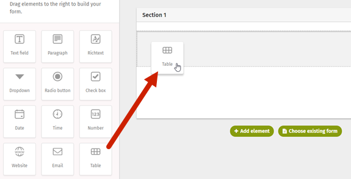

# Insert a table into a Form

One of the elements you can add to any form is a Table. Tables give you a dynamic way to collect data and organize your form fields. They are also very easy to set up.

The form creator specifies the number of columns and applies form elements and content to each column. Once live, users input their responses by adding rows. Each row will replicate the field elements and content that the form creator built into the columns.

1. In the form builder, drag and drop the Table element into your draft workspace. 

2.Click on the Table name to open the editor. In the editor you can set a name for the table, enter any instructions, and, if you want to, set a maximum on the number of rows users can create.

3.Click **Save** when you are finished with the editor and want to return to the workspace.

4.Build your Table by customizing your columns. Each column can house a different type of form element. Table columns can support any of these elements:

1. Text field
2. Paragraph
3. Dropdown
4. Radio button
5. Checkbox
6. Date
7. Time
8. Number \(a checkbox option is available to show a column total at the bottom of a number column\)
9. Website
10. Email
11. File upload
12. Image upload
13. People lookup
14. Telephone

5.To add a form element to a column, click on the cog inside the column to open the Field Type pop-up. Select the type of field you want the column to contain and click save.

6.Once your column has been populated with the field type of your choice, and the field editor will automatically be open and ready for you to customize. The editor lets you name the column, add instructions, and set other requirements.  
  
**Example field editor \(People lookup field\)**

**7.**After creating your first column, you can add additional columns by clicking Add column.

8.Continue adding and customizing columns until you have all the columns you require.

9.Preview your form to test if your table is displaying the way you need it to. You can also test out the user experience by adding rows and interacting with the information.

10.Exit out of the Preview to make changes to your form if need, and/or complete the rest of your form and Launch.

