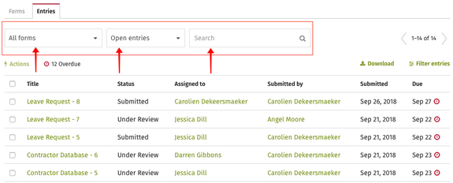
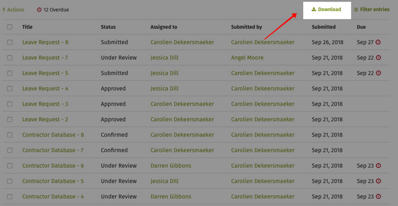

# Download Form entries

Occasionally you may need an overview of the form entries that have been submitted. The Form Entries page has options for you to filter and even download information about form entries.

1. From the Forms Overview page, select the Entries tab.
2. There are two dropdown menus and a search bar that can filter form entries:
   * **Forms dropdown** - This dropdown lets you select All Forms or a specific form.
   * **View/status dropdown** - This dropdown lets you filter form entries by predefined filters or views. You can choose from All entries, archived, in progress, overdue and more.
   * **Search bar** - The search bar works like any other search, it will filter the form entries by whatever keywords you search for.

     
3. When you have set your filters the way you want them, click the Download button on the top right of the page.   
4. There are 2 download options:
   1. **File type** - you can choose between Excel, Word or PDF
   2. **Fields to include** - you can choose between only fields shown in the Entries page, or all the fields in each form
5. If you choose Excel as your file type:
   1. The first sheet in the Excel file will be an About section that includes:
      1. Form name
      2. View name
      3. Any additional filters used
      4. Date of download
   2. If you select the “All fields in this form" option, then the information for each form will be displayed in its own sheet. This option is selected by default.
   3. If you select the "Only form fields \(columns\) shown in the table" option, all the form entries will be displayed in the same sheet. \(When viewing entries for a specific form, which form fields \(columns\) display in the table can be changed by clicking on Manage columns above the list of entries.\)
6. If you choose Word as your file type:
   1. At the top of the document, the “About” information will be displayed including:
      1. Form name
      2. View name
      3. Any additional filters used
      4. Date of download
   2. All of the entries will be organized by the form they are associated with, whether you select to include "All fields in this form" or "Only form fields \(columns\) show in the table" in the download.
7. If you choose PDF as your file type:
   1. Each entry will display the Entry name at the top of the page, followed by the Form name and the information from the fields displayed on the Entries page.
   2. If you select the “All fields in this form" option, then all of the form field information for each entry will be displayed on its own page\(s\). This option is selected by default.
   3. If you select the "Only form fields \(columns\) shown in the table" option, only the information from the fields displayed on the Entries page will be displayed for each entry on its own page. \(When viewing entries for a specific form, which form fields \(columns\) display in the table can be changed by clicking on Manage columns above the list of entries.\)
8. Regardless of which file type you choose, the download will contain all the information requested from the form entries you selected such as:
   1. Title
   2. Status
   3. Assigned to
   4. Submitted by
   5. Date submitted
   6. Due date

