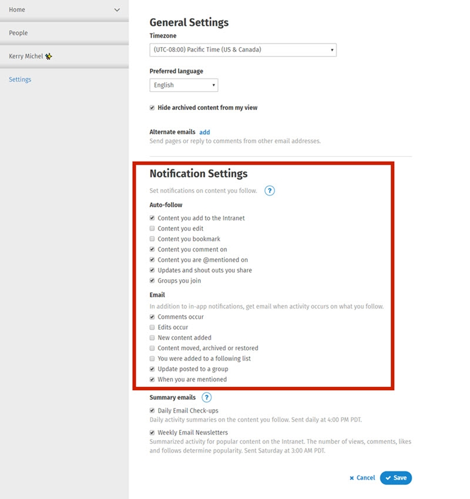

# Profile Settings

### Personalize your Profile Settings

In your Profile Settings you'll find a number of options that affect your interactions with the intranet - like your preferred language, timezone and notification preferences.  
  
You can access your Profile Settings in three ways:

1. Click on your **name or profile picture** in the top right, and click **Settings** in the menu that opens.
2. On your profile page, click the down arrow on the right to open the **Page Controls**. Then click **Settings**.
3. Click on the **Alerts** menu. In the **Notifications** tab, click the **gear icon** on the bottom right.

After making changes to your Profile Settings, make sure to click **Save** in the bottom right.  
  
In previous versions of ThoughtFarmer, the general and notification settings found on the Profile Settings page were accessed by editing your profile. Now you can access them in the ways mentioned above.  
  
Administrators can change the settings on a user's profile by going to the user's **profile page**, clicking the **down arrow** on the right of the **Page Controls**, and clicking **Settings** in the options that appear.

#### Settings

* **Timezone**: Select from a complete list of all timezones around the world. The times listed on calendars on your intranet will depend on your timezone.
* **Preferred language**: Choose the default language that you wish to view pages in. This will only be available if your intranet adminstrator has enabled multiple languages.
* Hide archived content from my view: Check the box to hide archived content from your view on the intranet. \(See [how to archive a page](../edit-page-contents/archive-and-delete-pages.md) for more information.\)
* **Alternate emails**: If you have multiple email addresses, enter them here to have your intranet recognize emails from these other addresses as coming from you. This allows you to use email addresses other than your primary one for features like [creating a page on the intranet by email](../add-pages-and-sections/add-a-page-via-email.md).

#### Notifications

* **Auto-follow**: Selecting these checkboxes will result in you automatically following content \(and receiving in-app notifications\) when you perform the listed actions to content \(add, edit, bookmark, comment, share, join group\), or when someone else @mentions you on the intranet. \(Learn more about [following and notifications](../basic-features/following-and-alerts/).\)
* **Email**: Selecting these checkboxes will result in you receiving an email notification when someone makes the corresponding actions on a page you follow.
* **Summary emails**: Choose whether to receive a Daily Email Check-up that summarizes activity on pages you have followed, and a Weekly Email Newsletter that summarizes activity on popular pages.

