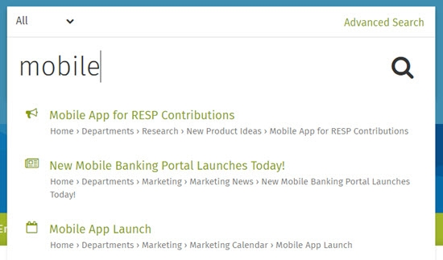

# Search

### How to use search features to find content quickly

Use these instructions to learn all the tricks of searching on your ThoughtFarmer intranet. Your intranet search is actually pretty cool and includes special sections for finding people and groups. You can narrow down the scope of search to within any section of the intranet, search just for people or groups, or browse all site content. You can also search the web using external search engines from within your intranet.

The left hand SuperNav allows you to browse through the site navigation, or has section search and filters available for pages with subpages.

Several different search filters help to narrow down search results, including by content type \(is it a page, a file, or a comment?\), by dates when something was added, by who has edited pages, by who owns pages, and by tags \([learn about tags](../tags/)\). When searching the People Directory you can narrow results by last name, by expertise and skills, by location or other group types, and by tags.  
  
If ThoughtFarmer SharePoint Connector is enabled on your intranet then your search results will include documents stored in connected SharePoint libraries.  
  
If [cloud drive integration](../cloud-drive-integration/) is enabled on your intranet, you can also use the main intranet search to find files and folders in cloud drives like Google Drive, Office 365 and SharePoint Online.

### Search features

**Did you mean?**: If you spell a word wrong when searching, **Did you mean** helps out by suggesting the word you might have meant.

**Find as you type**: When searching from the main search box, ThoughtFarmer will automatically search the intranet when you briefly pause typing. Search results show up in a dropdown menu and you can navigate to results without having to go to the search results page itself.  

### How do I?

* [Use the SuperNav](use-the-supernav.md)
* [Use search filters to narrow down results](use-search-filters.md)
* [Search the People Directory](search-the-people-directory.md)
* [Search the Groups Directory](search-the-groups-directory.md)
* [Search a section](search-a-section.md)
* [Search using an external search engine](search-using-an-external-search-engine.md)
* [Browse all site content](browse-all-site-content.md)
* [Learn more about search](learn-more-about-search.md)
* [Search cloud drives](../cloud-drive-integration/search-cloud-drives.md)

