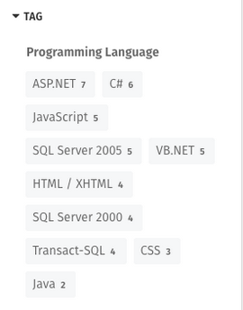

# Search the People Directory

### How to find someone using the People Directory

Use these instructions to search the People Directory and find the right person. You can search by name, title, phone number, or any other information that has been added to people's profile pages. You can also use search filters to narrow down your results.  
  
_Don't remember someone's last name?_ Search by first name and then narrow down results by last name and look through profile photo thumbnails.  
  
_Don't know who to contact?_ Search by title keywords, such as **office manager** or **customer service rep** and then use search filters to narrow down results by office.

### Select "People" in search dropdown menu

To get to the People Directory follow these steps. \(Or, if your intranet has a **People** tab in the global navigation just click on that and jump to **Step 3**.\)

1.At the top of any page click on **search** on the right of the Application Toolbar to open the Search dropdown.

2.Click on **All** above the **Search** box, and select **People** from the the dropdown menu that opens.

3Click in the **Search** box, enter your search term, and then hit **Enter** or click the search button \(mini magnifying glass\).

4.Scroll down through the list of results or click on search filters on the left-hand side of the page to narrow down results further.

5.Click on the name or photo of a person to see that person's full profile page.

### Select People Directory Grid or List view

You can choose to view the People Directory in one of two ways: Grid view or List view. Grid view displays people in a grid of cards with their photo, name and info. List view displays people in a vertical list. Grid view will likely allow you to see more people on your screen at one time. Grid view and List view may display different information about people depending on the settings your intranet administrator has chosen.  
  
**Grid View**

**List View**

Grid view is the default view of the People Directory, but the way you view the People Directory is controlled by you and specific to you. To change your view, click the Grid or List icons on the top left of the People Directory, just under the number of people. The intranet will remember your last selected view preference, and will display the People Directory that way next time you visit it.

### Search filters in People Directory

**Filter 1: Last name**

**Options**:

* List of letters

Use the **Last name** filter if you're not sure how to spell the full last name of someone you're looking for. If you click on **G** for instance you'll see only people who's last name begins with G.

**Filter 2: Expertise & Skills**

**Options**:

* List of top tags for each expertise area, plus search box

Use the **Expertise and Skills** filter to narrow down people search results based on someone possessing a skill, attribute or qualification. The **Expertise and Skills** filters come from tags that people add under the **Expertise and Skills** section of their profile pages. These tags are specifically designed to help you find people with the attributes that you need.  
  
This section can be used not only for fields of expertise but for any way of classifying and tagging users that is useful to your organization. Depending on the settings on your intranet, it may have a different name than **Expertise and Skills**.  
  
See [how to add expertise and skills to your profile](../profile-pages/add-expertise-and-skills-to-your-profile.md) for more information about this feature.

**Filter 3: Group Type**

**Options**:

* List of group categories and specific groups, plus search boxes

Use the **Group Type** filter to narrow down people search results by membership in an office, department, or any other group. The categories of groups depend on how your intranet administrator set up groups. You may have options for Office, Location, Department, Project, Team, Business Unit, or other group categories specific to your organization. Click on a group category to see the group filters available in that category.  
  
When you click on any group the search results will narrow to only people who are members of that office or group. Use this filter in combination with other filters to see very specific results.  
 

**Filter 4: Tag**

**Options**:

* List of top tags used, plus search box

Use the **Tag** filter to see only the profile pages to which someone has added a specific tag. You'll see listed the tags used most on the pages that show up in the search results. Click on one of the tags listed to see only results that have that tag.

**Other Filters**

Your intranet administrator may have added other headings and fields that can be filled out on profile pages. If this is the case, and there are other fields populated with tags, you may see additional filters on the left hand side of the People Directory.

### Type in a specific Expertise, Group or Tag to narrow results

For the Expertise & Skills, Group Type or Tag filters, if there are more options than are set to display, a search box will appear at the bottom of the list so you can type in a specific filter item to narrow down your search results.  
  
At the bottom of the filter list look for a small search box that says **Find group** or **Find tag**. Start typing in a keyword and a list of matching groups/tags will automatically appear; click on the one you want, and your search results will be refined.

### Undo search filters at top of page

Each time you click on a search filter the results page will refresh and the filter will show up in a box near the top of the page just below the search box. When you use multiple filters you'll see all of them listed individually at the top of the page.  
  
If a filter you chose turns out not to be helpful, remove it by clicking the grey **X** to the right of that filter's name at the top of the page. If you want to start your search from scratch click **Clear filters** to the right of the current filters.  

### Hot intranet tip!

**Tag your profile so people can find you**

The People Directory is a two-way street. It's easier for you to find other people when they have edited and tagged their profile pages and vice versa. Help people find you even if they don't know who you are by adding useful tags to your profile page.  
  
See complete instructions on [how to tag your profile page](../profile-pages/tag-your-profile.md).

**Profile only users**

There may be users in your People Directory who are there simply to make their contact information easy to find. These "Profile only" users are not able to log in to the intranet.

