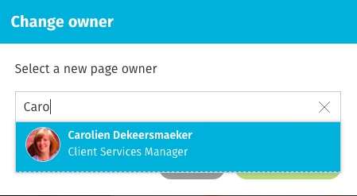

# Change the page owner

### How to change the page owner for a page

Use these instructions to change the person listed as the owner of a specific page. Every page and file on your intranet is attributed to someone, usually the person who created the page or uploaded the file. You can easily change the page owner; however, only the page owner or a person with edit permission on the page can change the page owner.

### Change the page owner

1.Make sure you have edit permission on the page.

2.Click the **down arrow** on the right of the page header to open the **Page Controls**.

3.In the **Info** tab of the Page Controls, click the **edit icon** \(a pencil\) beside the **Owner** heading. The **Change owner** pop-up window will appear

4.The current owner's name is selected. Start typing the new page owner's name, and click on the name in the dropdown menu that appears.

5.Click Done.

### Change the page owner in edit mode

1.Click the **Edit button** \(pencil icon\) to go into edit mode on the page you want to change.

2.Click the name of the current page owner under the **Security** section on the right. The **Change owner** pop-up window will appear.

3.The current owner's name is selected. Start typing the new page owner's name, and click on the name in the dropdown menu that appears.

4.Click **Done**.

5.Click **Save**.

### Hot intranet tip!

**Ask site administrator for help to change owner for large number of pages**

If you need to change the page owner for a large number of pages, ask your intranet administrator for help. List all the pages you'd like changed and list the new page owner. The administrator can make bulk changes through the intranet's Administration Panel.  
  
If you're an intranet administrator see change page ownership for more information.

