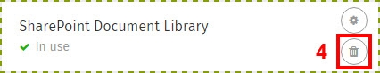

# Add a SharePoint Library Card

### How to insert & remove SharePoint document library Cards

Use these instructions to insert a document library from your SharePoint sites on a page of your ThoughtFarmer intranet. In just a few steps, you can add a SharePoint Card, which allows you to easily access, edit, and add to documents stored in your company's SharePoint sites.  
  
If your intranet administrator has connected the intranet to SharePoint sites you can add a SharePoint Card containing any document library from those sites to an intranet page. If you don't see the SharePoint document library Card as an option on your intranet, contact your site administrator. 

### Edit page to insert SharePoint Document Library Card

1.**Add** a new page or click **Edit** to open a page for editing. 

2.Click **Set up cards** under the **Content type & template** heading on the right. The **Card setup window** will open.  

3.In the **Card setup window**, find the **SharePoint Card** section and click **Set up** below it \(or **add a SharePoint Card** by clicking **Modify template**, clicking the **plus sign** where you want the card, and then picking SharePoint from the cards menu on the right. Then click **Set up** on the Card\).

4.elect a **SharePoint site** from the **Site** dropdown list.

  
5.Click on the name of the **document library** you want.

6.Click **Update** on the bottom right of the **SharePoint setup window**.

7.Click **Done** at the bottom of the **Card setup window**.

8.Click **Save** in the top right.

### Remove SharePoint Card in edit mode

1.Navigate to the page with the SharePoint Card you wish to remove and go into **edit mode**.

2.Click **Set up cards** under the **Content type & template** heading on the right. The **Card setup window** will open.

3.In the **Card setup window**, click **Modify template**.

  

4.Find the **SharePoint Card** you want to delete and click the **garbage can icon** on it.

5.Click **Done** at the bottom of the **Card setup window**.

6.Click **Save** in the top right.

